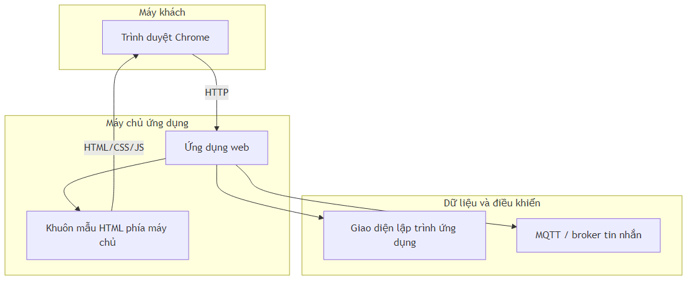
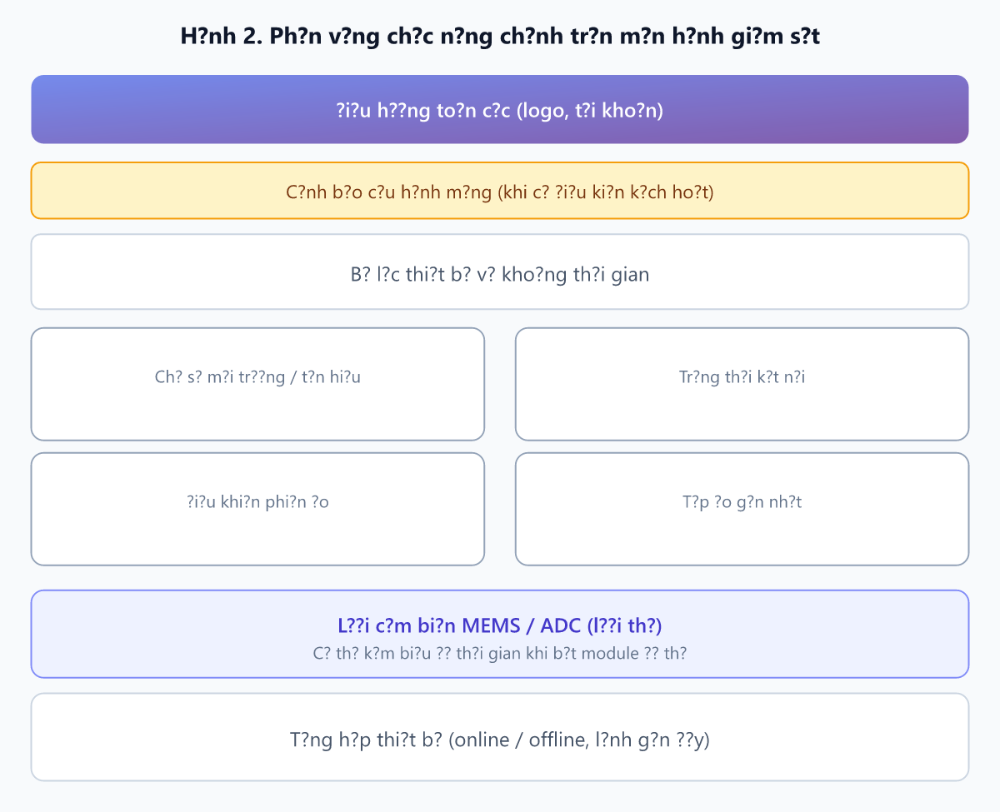
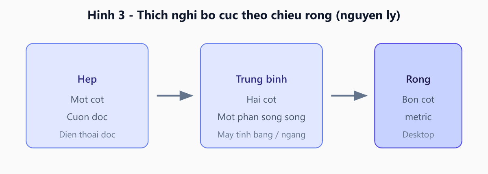
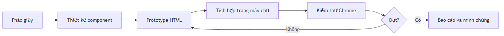
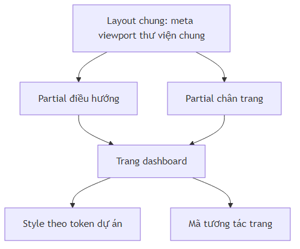

# Báo cáo thiết kế giao diện người dùng cho hệ thống giám sát Electric-Nose (dashboard web)

---

## Tóm tắt

Báo cáo trình bày các quyết định thiết kế giao diện cho **dashboard web** giám sát và điều khiển trong hệ E‑Nose (giao tiếp phía backend qua MQTT, không đi sâu tầng phần cứng nhúng tại đây). Đối tượng **truy cập giao diện** chính là máy tính để bàn; điện thoại hỗ trợ qua bố cục đáp ứng theo chiều rộng khung nhìn. Tầng hiển thị dùng khuôn mẫu phía máy chủ và Bootstrap; phác thảo đa phương tiện, tái sử dụng mã, kiểm thử Chrome và kích thước tương tác được tóm tắt phù hợp độ chi tiết các mục còn lại. Kết quả minh họa bằng sơ đồ kiến trúc, khối chức năng màn hình và nguyên lý responsive.

**Từ khóa:** giao diện người dùng; thiết kế web đáp ứng; Bootstrap; dashboard IoT; E‑Nose; kiểm thử trình duyệt.

---

## 1. Giới thiệu và phạm vi

Tài liệu đáp ứng các câu hỏi: (i) thiết bị truy cập giao diện (trình duyệt); (ii) thích nghi khi đổi hướng màn hình; (iii) framework và công nghệ; (iv) quy trình phác họa; (v) thống nhất bố cục và giảm trùng lặp mã; (vi) kiểm thử và kích thước tương tác (tóm tắt); (vii) bảng phản ánh khó khăn — lựa chọn — lý do.

**Bảng 1.** Ánh xạ yêu cầu đề bài với cấu trúc các mục trong báo cáo

| Yêu cầu | Mục trình bày | Ghi chú bổ sung cần hoàn thiện khi nộp |
|---------|---------------|----------------------------------------|
| Thiết bị: máy tính / điện thoại | Mục 2 | Có thể bổ sung ngữ cảnh triển khai thực tế (phòng thí nghiệm, demo). |
| Xoay ngang / dọc | Mục 3 | Ghi nhận kết quả quan sát sau thử nghiệm thủ công. |
| Framework | Mục 4 | Ghi phiên bản thư viện nếu giảng viên yêu cầu độ chính xác tuyệt đối. |
| Phác họa: giấy, HTML/CSS, Figma | Mục 5 | Đính kèm ảnh chụp sketch, export hoặc liên kết thiết kế; ảnh chụp màn hình prototype. |
| Thống nhất, tái sử dụng mã | Mục 6 | Cập nhật theo trạng thái thực tế sau khi chỉnh mã nguồn. |
| Kiểm thử Chrome; nút bấm và cỡ chữ | Mục 7 (tóm tắt) | Chi tiết thực nghiệm và ảnh minh chứng bổ sung khi nộp (theo yêu cầu môn). |
| Khó khăn — lựa chọn — lý do | Mục 8 (Bảng 5) | Thêm dòng theo kinh nghiệm nhóm nếu cần. |

---

## 2. Thiết bị truy cập mục tiêu

### 2.1. Kết luận

**Bảng 2.** Phân cấp thiết bị truy cập

| Mức ưu tiên | Loại thiết bị | Vai trò sử dụng dự kiến |
|-------------|---------------|-------------------------|
| Chính | Máy tính để bàn hoặc laptop | Đọc đồng thời nhiều kênh đo, điều khiển phiên đo, theo dõi trạng thái; phù hợp ngữ cảnh phòng thí nghiệm. |
| Phụ | Điện thoại thông minh | Xem nhanh trạng thái, thao tác cơ bản; yêu cầu bố cục không vỡ và văn bản đọc được. |

### 2.2. Cơ sở kỹ thuật

Giao diện là **trang web** (trình duyệt, không ứng dụng native): viewport và lưới đa cột thích nghi theo chiều rộng. Phạm vi mục này chỉ **máy khách hiển thị**; luồng dữ liệu và thiết bị đo phía hiện trường không được mở rộng tại đây.

**Hình 1.** Kiến trúc tầng liên quan đến hiển thị giao diện (đơn giản hóa)

---

## 3. Thích nghi khi xoay ngang và xoay dọc

### 3.1. Trả lời ngắn

Có thích nghi, theo nghĩa **bố cục đáp ứng (responsive)**: sắp xếp lại cột và khối khi chiều rộng khung nhìn thay đổi — hiện tượng tương ứng với việc người dùng xoay thiết bị cảm ứng.

### 3.2. Cơ chế

Ngưỡng chiều rộng theo thư viện giao diện (breakpoint) quyết định số cột hiển thị; cụm nút dùng bố cục uốn dòng để tránh tràn ngang. Không bắt buộc dùng truy vấn media theo `orientation` riêng; hành vi chủ yếu gắn với `min-width` / `max-width`.

### 3.3. Rủi ro và kiểm thử

Các khối biểu đồ thời gian (khi được kích hoạt trong mã nguồn) cần được kiểm tra thêm về legend và chiều cao vùng vẽ khi đổi hướng. Hộp thoại lớp phủ (ví dụ cấu hình mạng cục bộ) cần không vượt quá khung nhìn. Prototype tĩnh đi kèm dự án minh họa cho phép thử nhanh hộp thoại trên cùng trình duyệt.

**Hình 2.** Phân vùng chức năng chính trên màn hình giám sát (minh họa khối)

**Hình 3.** Nguyên lý thích nghi bố cục theo chiều rộng (hẹp → trung bình → rộng)

---

## 4. Framework và stack giao diện

### 4.1. Có sử dụng framework không?

Có. Tầng hiển thị sử dụng **thư viện thành phần giao diện Bootstrap (phiên bản 5)** qua mạng phân phối nội dung; khuôn mẫu trang được sinh **phía máy chủ** (Embedded JavaScript templates). Ứng dụng **không** dùng mô hình đơn trang (SPA) kiểu React/Vue trong khai báo phụ thuộc dự án hiện tại.

### 4.2. Bảng tổng hợp

**Bảng 3.** Công nghệ liên quan giao diện

| Tầng | Công nghệ | Vai trò |
|------|-----------|---------|
| Thời gian chạy máy chủ | Node.js | Môi trường thực thi |
| Khung ứng dụng web | Express | Định tuyến, API, kết xuất view |
| Khuôn mẫu | EJS | Tách partial layout và nội dung trang |
| Giao diện | Bootstrap 5 | Lưới, thẻ, nút, biểu mẫu |
| Biểu tượng | Bootstrap Icons | Nhất quán họa tiết UI |
| Đồ thị (tùy cấu hình) | Chart.js | Trực quan hóa chuỗi thời gian |
| Hộp thoại | SweetAlert2 | Luồng đăng nhập / thông báo |
| Bản đồ (một số trang) | Leaflet | Không trọng tâm dashboard E‑Nose |

---

## 5. Phác họa giao diện và nội dung chính

### 5.1. Các khối chức năng cần mô tả trong phác thảo

1. Khung điều hướng và nhận diện hệ thống.  
2. Vùng cảnh báo hoặc hướng dẫn kết nối mạng thiết bị (khi điều kiện kích hoạt).  
3. Bộ lọc thiết bị và thời gian.  
4. Chỉ số tổng quan (môi trường, tín hiệu không dây, trạng thái).  
5. Điều khiển phiên đo và hiển thị tệp đo.  
6. Lưới kênh cảm biến (tám kênh) và (tuỳ chọn) biểu đồ.  
7. Tổng hợp số lượng thiết bị và hoạt động điều khiển gần đây.  
8. Luồng xác thực người dùng trên thanh điều hướng.

### 5.2. Ba hình thức phác thảo

**Bảng 4.** Phương pháp phác thảo và đầu ra minh chứng

| Phương pháp | Mục đích | Đầu ra đề xuất |
|-------------|----------|----------------|
| Phác tay trên giấy | Nhanh, thống nhất thứ tự ưu tiên thông tin | Ảnh chụp hoặc scan, ghi ngày và tác giả |
| Prototype HTML/CSS | Kiểm tra tràn chữ, cuộn, breakpoint sớm | Ảnh chụp màn hình hoặc bản build tĩnh |
| Figma (hoặc tương đương) | Thống nhất màu, component, handoff | Liên kết thiết kế hoặc file export |

### 5.3. Luồng quy trình thiết kế (sơ đồ)

**Hình 4.** Quy trình phác thảo đến triển khai và kiểm thử

### 5.4. Prototype tĩnh đi kèm báo cáo kỹ thuật

Để đáp ứng yêu cầu minh họa bằng HTML/CSS/JS mà không phụ thuộc máy chủ, một **bản prototype đơn trang** đã được xây dựng: tái hiện thanh điều hướng, bộ lọc, chỉ số, điều khiển đo, vùng tệp đo, lưới tám kênh, khối giả lập timeline, hộp thoại cấu hình mạng (nội dung thay thế cho iframe thiết bị thật khi mở tệp cục bộ). Kiểu dáng thị giác bám theo token màu và độ bo góc của dashboard triển khai chính. Mã sự kiện minh họa: bật/tắt cảnh báo, mở/đóng modal, mô phỏng bắt đầu/dừng đo, phản hồi bộ lọc.

---

## 6. Thống nhất bố cục, tái sử dụng mã và hạn chế trùng lặp

### 6.1. Nguyên tắc

- Dùng chung **layout** (phần đầu trang, thanh điều hướng, chân trang) để đồng nhất vị trí logo và điều hướng.  
- Chuẩn hóa **biến màu** toàn cục (ví dụ vai trò màu nhấn, cảnh báo, thành công).  
- Một **hệ phân cấp chữ** (tiêu đề trang, tiêu đề vùng, nội dung, chú thích).  
- Khoảng cách theo **bội số cố định** (ví dụ 8 px) giữa các vùng.

### 6.2. CSS và JavaScript

Ưu tiên lớp dùng chung hoặc một nguồn style; tránh nhân đôi khối quy tắc giống hệt giữa các trang. Logic lặp (định dạng số, sinh thẻ kênh) nên gom thành một hàm. Tránh tải **hai lần** cùng một thư viện (Bootstrap, Chart.js) trên một trang.

### 6.3. Ghi nhận nợ kỹ thuật

Có khả năng **trùng lặp hoặc lệch phiên bản** thư viện giao diện giữa layout chung và trang dashboard — cần rà soát và hợp nhất một nguồn Bootstrap 5 trong phiên bản sau.

**Hình 5.** Mối quan hệ tái sử dụng giữa layout chung và trang nội dung

---

## 7. Kiểm thử và kích thước tương tác (tóm tắt)

Kiểm thử giao diện thực hiện **thủ công trên Google Chrome** (máy tính và điện thoại, có thể dùng Device Toolbar), thử trên prototype tĩnh rồi bản có máy chủ; ảnh màn hình có chú thích đính kèm bản nộp theo yêu cầu môn học. **Vùng bấm** và **chữ** bám mức tham chiếu thông dụng (khoảng 44–48 px cho thao tác chính trên cảm ứng; chữ nội dung khoảng 14–16 px, đủ tương phản); lý do và đánh đổi thiết kế được gom ở **mục 8**, không mở rộng checklist hay bảng nhật ký tại đây để tránh trùng mức chi tiết với bảng phản ánh thiết kế.

---

## 8. Bảng phản ánh thiết kế: khó khăn — lựa chọn — lý do

**Bảng 5.** Tổng hợp quyết định thiết kế

| STT | Khó khăn | Lựa chọn | Lý do |
|-----|----------|----------|--------|
| 1 | Mật độ thông tin cao (tám kênh + trạng thái) | Lưới nhiều cột trên màn rộng; thứ tự dọc: an toàn vận hành → điều khiển → chi tiết kênh | Giảm nhầm lẫn; tận dụng không gian desktop |
| 2 | Đồng bộ trạng thái thiết bị với máy chủ | Hiển thị theo logic làm mới dữ liệu và ngưỡng “còn hoạt động” | Tránh hiển thị phiên đo khi mất kết nối |
| 3 | Chiều rộng màn hình di động hẹp | Cuộn dọc; hạn chế bảng cứng; ưu tiên thẻ | Đọc và chạm ổn định |
| 4 | Trùng lặp thư viện / style | Kế hoạch hợp nhất một nguồn Bootstrap và tách CSS dùng chung | Giảm xung đột và kích thước tải |
| 5 | Nhiều người chỉnh sửa UI | Một file thiết kế master (Figma) và quy ước đặt tên lớp | Đồng bộ hình ảnh thương hiệu và bố cục |
| 6 | Biểu đồ trong mã nguồn chính chưa bật; vẫn cần minh họa HTML | Prototype tĩnh với khối timeline giả lập và cùng token màu | Đáp ứng yêu cầu báo cáo và demo ngoại tuyến |
| 7 | Mở tệp cục bộ hoặc iframe tới điểm truy cập thiết bị không khả dụng khi chấm | Modal dùng nội dung thay thế; ảnh minh chứng ưu tiên môi trường có máy chủ | Tránh lỗi bảo mật/mạng; vẫn mô tả đúng luồng tương tác |
| 8 | *(Dòng dự phòng cho nhóm)* | | |

---

## 9. Kết luận

Hệ thống giao diện dashboard Electric-Nose được định hướng **ưu tiên máy tính**, **hỗ trợ di động qua bố cục đáp ứng**, sử dụng **Bootstrap 5** cùng **khuôn mẫu phía máy chủ** và tích hợp thư viện phụ trợ theo nhu cầu. Quy trình phác thảo đa phương tiện (giấy, Figma, HTML) làm rõ yêu cầu giao diện trước khi tích hợp; kiểm thử và kích thước tương tác được **tóm tắt ở mục 7**, còn **mục 8** gom các quyết định thiết kế chính. Các sơ đồ và hình minh họa hỗ trợ trình bày **cấu trúc chức năng** và **nguyên lý responsive**.

---

## Phụ lục A. Thông tin nộp bài

**Bảng 6.** Metadata báo cáo (điền đầy đủ)

| Trường | Nội dung |
|--------|----------|
| Tên học phần | |
| Lớp / học kỳ | |
| Nhóm | |
| Ngày nộp | |
| Liên kết thiết kế Figma (nếu có) | |

---

## Phụ lục B. Nguồn tham chiếu kỹ thuật (mô tả, không liệt kê tên tệp)

- **Tầng presentation:** khuôn mẫu layout chung (viewport, thư viện), partial thanh điều hướng và chân trang, trang giám sát thiết bị với style nhúng và lưới đa cột.  
- **Tài liệu mô tả hệ thống:** tóm tắt kiến trúc IoT, API và luồng dữ liệu thời gian thực.  
- **Prototype tĩnh:** một trang HTML độc lập với stylesheet và script minh họa sự kiện, đặt cùng thư mục tài liệu dự án.  
- **Minh chứng hình ảnh:** ảnh chụp sketch, export thiết kế, ảnh màn hình kiểm thử — kèm báo cáo hoặc trong thư mục minh chứng theo hướng dẫn giảng viên.
