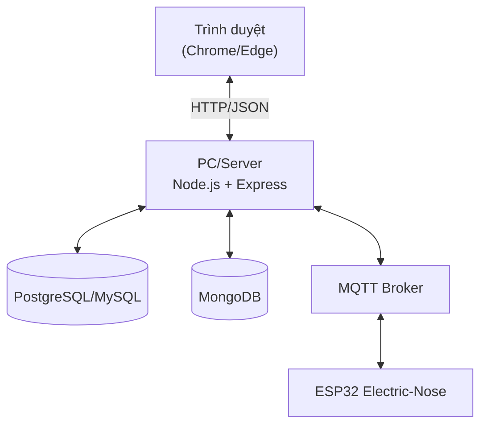
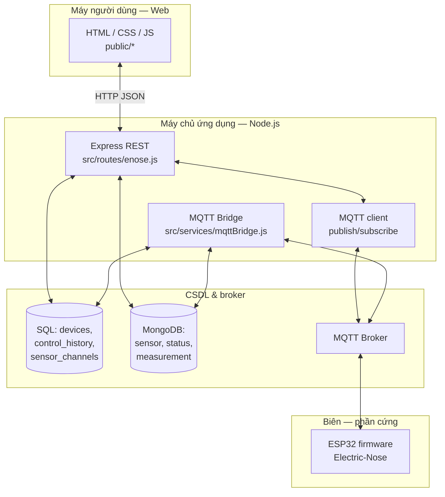
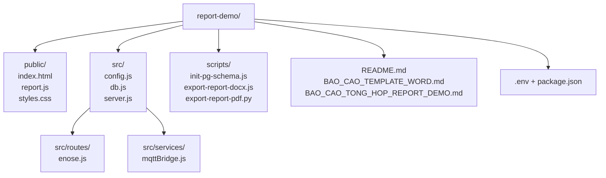

# Báo cáo bài tập lớn — Electric-Nose Monitoring Report Demo (`report-demo`)

Theo **Hướng dẫn viết báo cáo và thang điểm (AC2070 — Lập trình Web)**.

---

## Trang bìa (điền đầy đủ trước khi nộp)

- Trường / Khoa / Môn học: `[điền theo ĐHBK / giảng viên]`
- Tên đề tài: **Electric-Nose Monitoring Report Demo** (standalone `report-demo`)
- Mã môn học / Mã số đề tài (01 / 02 / 03): `[điền]`
- Thời gian thực hiện: `[điền]`
- Danh sách thành viên + MSSV: `[điền]`
- Nhóm trưởng: `[điền]`
- Tên file Word nhóm (theo HD): `group01_ltweb_electric-nose-report-demo.docx` (đổi `01` và slug theo quy định lớp)

---

## Phần 1. Giới thiệu

### 1. Giới thiệu yêu cầu đề bài

Hệ thống **report-demo** là ứng dụng web **standalone** trong một thư mục, gồm:

- **Frontend:** dashboard đa khung nhìn (menu trái: Dashboard, Quản lý thiết bị, Biểu đồ, Lịch sử, Cài đặt), chuyển tab rõ ràng trên mobile; KPI (nhiệt độ, độ ẩm, Wi-Fi), sparkline, lưới **8 kênh ADC / MEMS** theo **cấu hình kênh** đọc từ SQL; **hai biểu đồ Chart.js** trên tab Biểu đồ (nhiệt độ + độ ẩm; **8 đường ADC** EtOH1–6, VOC1–2 từ mảng `adc` / `ADC0…7` trong Mongo); khối **file đo mới nhất** (tên chuẩn, tải CSV/xóa bản ghi, link máy chủ file theo IP ESP khi có); bảng lịch sử điểm đo Mongo; giao diện sáng/tối; xem cấu hình công khai qua `/config.json`. Ô `fromTime`/`toTime` dùng nội bộ cho **cửa sổ 24h** và export CSV; khi tải biểu đồ, client chỉ gửi **`from`** lên API để không cắt mất mẫu trong cùng phút.
- **Backend:** Express 5, REST API prefix `/api/enose`, middleware `express.json()`, phục vụ tĩnh `public/`.
- **MQTT bridge:** subscribe topic `electric-nose/device/...` (chuẩn hóa segment `sensor`), parse payload (gồm mảng **`adc`**, alias `ADC0…`), ghi **MongoDB** với **`time` = thời điểm máy chủ nhận** (để sort/history khớp thứ tự thực tế; tùy chọn giữ `firmware_timestamp` trong `content`), đồng bộ metadata **SQL** (PostgreSQL hoặc MySQL tuỳ `.env`).
- **CSDL:** SQL — `enose_devices`, `enose_control_history`, `enose_sensor_channels`; MongoDB — các collection theo model trong `src/db.js` (ví dụ `sensor`, `device_status`, `measurement_data`).

Luồng nghiệp vụ chính: ESP32 Electric-Nose gửi dữ liệu qua broker MQTT → bridge lưu CSDL → trình duyệt gọi REST (và polling định kỳ) để hiển thị và gửi lệnh điều khiển.

### 2. Những thay đổi / lưu ý so với đề bài (cho giảng viên khi chấm)

- **CRUD trên CSDL:** barem yêu cầu đủ thao tác đọc / ghi / sửa / xóa. Với **một thiết bị ESP32** cố định, **không** dùng “xóa thiết bị” làm minh hoạ xóa (tránh mất thiết bị demo). Thay vào đó nhóm triển khai **CRUD cấu hình kênh cảm biến** trên bảng SQL `enose_sensor_channels` (`channel_index` 0..31, `label`, `unit`, `sort_order`, soft-delete `delete_flag`).
- **Giao diện:** bổ sung **menu sidebar** và tách **view** theo chức năng để báo cáo và demo rõ ràng hơn so với một trang đơn.
- **Điều khiển Stop:** firmware có thể xử lý ACK không thống nhất; backend gửi nhiều topic tương thích (đoạn mã trong `src/routes/enose.js`) — cần ghi nhận là **rủi ro tích hợp**, không phải lỗi hiển thị.

### 3. Bảng tổng kết chức năng phần mềm đã thực hiện

| Chức năng | Mô tả ngắn | Làm được / Chưa | Người phụ trách | Hình minh hoạ (gợi ý) | Ghi chú |
| --- | --- | --- | --- | --- | --- |
| Dashboard và điều hướng | Sidebar, KPI, sparkline, chọn thiết bị, điều khiển đo / heating / pump | Có | `[điền]` | Hình 1–3 | Polling ~10s |
| Biểu đồ theo thời gian | Tab Biểu đồ: Chart.js nhiệt độ/ẩm + **8 kênh ADC**; cửa sổ 24h (ẩn input); làm mới theo polling / Lịch sử | Có | `[điền]` | Hình 4–6 | GET history |
| File đo mới nhất | Khối tóm tắt file đo, tải CSV chuẩn header, xóa bản ghi, link máy chủ file (IP ESP) | Có | `[điền]` | Hình 7a | API measurements + export |
| Start / Stop đo | MQTT measurement start/stop, ghi Mongo + SQL history | Một phần | `[điền]` | Hình 7–9 | Phụ thuộc firmware ACK |
| Heating / Air pump | Điều khiển qua MQTT, ghi `enose_control_history` | Có | `[điền]` | Hình 10–11 | POST body JSON |
| Lịch sử điểm đo | Tab Lịch sử: bảng sensor (thời gian, °C, %RH, ADC tóm tắt) | Có | `[điền]` | Hình 12 | GET `/devices/:id/history` (query `from`, `limit`; biểu đồ không gửi `to`) |
| Cài đặt | Tab Cài đặt: hiển thị `/config.json` (không lộ secret) | Có | `[điền]` | Hình 13 | Chỉ đọc |
| CRUD kênh cảm biến | Thêm / sửa / xóa mềm kênh SQL `enose_sensor_channels` | Có | `[điền]` | Hình 14–17 | Barem CRUD trên CSDL |
| API đọc telemetry | latest, status, measurements, active, control/status | Có | `[điền]` | Hình 3, 8 | REST |
| MQTT bridge | Subscribe, parse, persist Mongo/SQL | Có | `[điền]` | Sơ đồ PH | `mqttBridge.js` |
| Quản lý thiết bị (metadata) | Danh sách thiết bị SQL, chọn thiết bị | Có | `[điền]` | Hình 2 | Không xóa thiết bị trong demo |

### 4. Bảng tổng kết làm được / chưa làm / điểm mới / hạn chế

| Hạng mục | Làm được | Chưa làm được | Điểm mới / nổi bật | Hạn chế / tự nhận xét | Hướng cải tiến |
| --- | --- | --- | --- | --- | --- |
| UI/UX | Có | — | Sidebar, multi-view, Bootstrap 5 | Biểu đồ cần resize khi đổi tab (đã xử lý trong code) | Skeleton, toast lỗi |
| CSDL | Có | — | SQL + Mongo, bảng kênh cảm biến | Dọn Mongo theo quy ước topic | Chuẩn hóa mapping topic |
| API / Backend | Có | — | REST đầy đủ, tương thích nhiều topic stop | Stop phụ thuộc firmware | Một contract stop duy nhất |
| Middleware / Auth | Có (JSON body) | Auth đăng nhập | `express.json` cho POST | Demo nội bộ không role | API key nếu public |
| JS (FE) | Có | — | fetch, Chart.js, CRUD kênh | Polling cố định | SSE/WebSocket |
| Triển khai | Có | — | Một folder, script init PG | Cần chuẩn bị SQL + Mongo + MQTT trước giờ demo | Local PowerShell |

### 5. Bảng phân công công việc

| Thành viên | Tỷ lệ đóng góp | Vai trò | Nhiệm vụ (user-facing) | Nhiệm vụ (nội tại / BE / DB) | Middleware phụ trách | Mức độ hoàn thành | Evidence | Ghi chú |
| --- | --- | --- | --- | --- | --- | --- | --- | --- |
| Nguyễn Nhật Bảo | 50% | Nhóm trưởng / Backend chính | Dashboard tổng thể, điều khiển đo, trình bày kiến trúc | `src/routes/enose.js`, publish MQTT command, tích hợp SQL + Mongo, xử lý luồng khó (start/stop/heating/pump) | `express.json()` | Đạt | commit/PR, demo API | Phụ trách phần kỹ thuật phức tạp nhất |
| Dương Huyền Ninh | 25% | Frontend / UI | Sidebar, tab Biểu đồ, tab Lịch sử, trải nghiệm người dùng | `public/report.js`, Chart.js, kiểm thử luồng fetch và cập nhật UI | `express.static()` | Đạt | commit/PR, ảnh demo | Tập trung phần trực quan và thao tác |
| Hồ Nguyễn Huyền Diệu | 25% | Triển khai + Tài liệu + QA | Kịch bản demo end-to-end, tổng hợp kết quả test, hoàn thiện tài liệu nộp | Cài đặt môi trường, script chạy demo, chuẩn bị dữ liệu mẫu, mô tả CSDL cơ bản, viết đánh giá hệ thống và hướng phát triển | `express.static()` (khai thác phía vận hành) | Đạt | checklist chạy, ảnh minh chứng | Đã tăng phần việc độc lập thay vì chỉ hỗ trợ |

### 6. Bảng kỹ thuật đã sử dụng kèm chức năng

| Chức năng | Người thực hiện | CSS | JS | Middleware | Form input | API (FE–BE) | CSDL |
| --- | --- | --- | --- | --- | --- | --- | --- |
| Dashboard và sidebar | `[điền]` | x | x | x | x | x | SQL + Mongo |
| Biểu đồ Chart.js | `[điền]` | x | x | x | x | x | Mongo |
| Start / Stop đo | `[điền]` |  | x | x | x | x | SQL + Mongo + MQTT |
| Heating / Air pump | `[điền]` |  | x | x |  | x | SQL + MQTT |
| Lịch sử điểm đo | `[điền]` | x | x | x |  | x | Mongo |
| Cài đặt (/config.json) | `[điền]` | x | x | x |  | x | — |
| CRUD kênh cảm biến | `[điền]` | x | x | x | x | x | SQL |
| Chọn thiết bị / filter thời gian | `[điền]` | x | x | x | x | x | SQL |

---

## Phần 2. Thiết kế

### 1. Sơ đồ hệ thống phần cứng (chèn **Hình PH** trong Word)

**Sơ đồ phần cứng bằng Mermaid (khuyến nghị dùng trực tiếp để render ảnh):**

**Mô tả hoạt động (văn bản kèm hình):** Người dùng thao tác trên trình duyệt; máy chạy `report-demo` nhận HTTP, đọc/ghi SQL và MongoDB, publish/subscribe MQTT tới broker; thiết bị ESP32 đăng ký topic theo `device_code` (ví dụ `AirSENSE`) và gửi payload sensor / nhận lệnh đo và actuator.

**Chi tiết luồng dữ liệu và lệnh (mô tả bổ sung):**

- **Kéo (pull) phía trình duyệt:** client **không** nối trực tiếp MQTT; giao diện dùng `fetch` gọi REST (`GET /api/enose/...`) theo chu kỳ hoặc sau khi người dùng bấm cập nhật. Dữ liệu trả về phản ánh trạng thái đã được lưu trong **MongoDB** (điểm đo, trạng thái thiết bị, phiên đo) và **SQL** (danh thiết bị, lịch sử lệnh, bảng kênh cảm biến). Cách này đơn giản hoá bảo mật và tương thích mọi trình duyệt.
- **Đẩy (push) phía ESP32:** firmware định kỳ hoặc theo sự kiện **publish** payload lên MQTT broker theo `device_code`. Broker phân phối tới các subscriber (ở đây là dịch vụ Node chạy `mqttBridge`).
- **Ví dụ đặt tên topic:** telemetry thường dùng dạng `electric-nose/device/<device_code>/sensor`. Lệnh đo / dừng đo có thể tới `.../measurement/start`, `.../measurement/stop` kèm topic dự phòng `.../control` (và một số topic `settings/...`, `control/pump`, …) để tương thích firmware cũ/mới — logic cụ thể nằm trong `src/routes/enose.js`.
- **Hai lớp CSDL trên sơ đồ:** PostgreSQL/MySQL lưu cấu hình ít thay đổi và vết điều khiển; MongoDB lưu chuỗi thời gian dày đặc. Server là lớp trung gian gom dữ liệu trả về một JSON thống nhất cho dashboard.

### 2. Sơ đồ khối / kiến trúc phần mềm (chèn **Hình PM** trong Word)

Có thể vẽ lại từ sơ đồ Mermaid dưới đây (Word: Insert → SmartArt hoặc copy ảnh export từ draw.io).

**Phối hợp khi chạy (tóm tắt):** `server.js` khởi tạo kết nối DB, mount router `/api/enose`, phục vụ file tĩnh `public/`, đồng thời khởi động `mqttBridge` để luôn lắng nghe broker và cập nhật CSDL. Frontend gọi **GET** để đọc trạng thái, **POST/PATCH** để điều khiển thiết bị và CRUD kênh; ESP không bắt buộc phản hồi HTTP — mọi cập nhật phía thiết bị vào hệ thống qua **MQTT**.

**Tách vai trò REST và MQTT bridge:** `mqttBridge.js` đảm nhiệm **subscribe** các topic đã cấu hình, nhận message, parse và **ghi** MongoDB (và cập nhật SQL khi cần). Các handler trong `enose.js` chủ yếu **đọc/ghi CSDL** qua knex/mongoose và, khi có lệnh từ người dùng, dùng **cùng MQTT client** để **publish** xuống thiết bị (start/stop đo, heating, bơm khí, …) đồng thời có thể ghi `enose_control_history`. Tóm lại hai đường: **đi lên** — ESP → broker → bridge → DB → `GET` của UI; **đi xuống** — UI → `POST` API → publish MQTT → ESP.

**Luồng đọc so với luồng ghi:** Đọc hiển thị dashboard chủ yếu qua REST đọc DB đã được bridge làm mới. Ghi lệnh điều khiển đi từ REST → MQTT (rồi firmware xử lý); ghi cấu hình kênh đi REST → SQL (không bắt buộc qua MQTT). Nhờ phân tách rõ, dễ mô tả barem “API + CSDL + middleware” và luồng realtime riêng.

### 3. Bảng thành phần — môi trường triển khai (bổ sung yêu cầu “chạy trên module nào”)

| Thành phần | Chạy trên | Giao tiếp chính |
| --- | --- | --- |
| Giao diện dashboard | Trình duyệt (client) | HTTP(S) tới Express, `fetch` JSON |
| API + static file | Node.js (server) | knex / mongoose, MQTT |
| PostgreSQL hoặc MySQL | Máy chủ DB | SQL wire protocol |
| MongoDB | Máy chủ DB | MongoDB wire protocol |
| MQTT Broker | Máy chủ / dịch vụ (Mosquitto, …) | MQTT 3.1.1 / 5 |
| Firmware Electric-Nose | Vi điều khiển **ESP32** | Wi-Fi → MQTT |

### 4. Kiến trúc code — sơ đồ cấu trúc thư mục bằng Mermaid

### 5. Vai trò file / thư mục chính

| File / thư mục | Nhiệm vụ |
| --- | --- |
| `src/server.js` | Bootstrap Express, `express.static('public')`, mount `/api/enose`, khởi tạo DB và MQTT bridge |
| `src/routes/enose.js` | Định nghĩa toàn bộ endpoint đọc dữ liệu, điều khiển, CRUD `enose_sensor_channels` |
| `src/services/mqttBridge.js` | Subscribe topic thiết bị, parse payload, upsert Mongo / cập nhật SQL khi cần |
| `src/db.js` | Knex + Mongoose, model collection |
| `src/config.js` | Đọc biến môi trường `.env` |
| `public/report.js` | View switching, polling, Chart.js, bảng lịch sử, form CRUD kênh, gọi API |
| `public/styles.css` | Bố cục sidebar, card, responsive |
| `scripts/init-pg-schema.js` | Tạo bảng PG + seed thiết bị + kênh mặc định |

**Luồng xử lý trong mã (minh họa một chu kỳ “đọc” UI):** Người dùng đang xem Dashboard; `report.js` gọi `GET /api/enose/devices/:id/latest` (và các endpoint tương ứng). `enose.js` tra `device_code`, truy vấn Mongo document sensor **mới nhất** theo `_id`, đồng thời có thể đọc SQL cho metadata; trả JSON. **Số lớn trên thẻ từng kênh ADC** và sparkline ngắn trên Dashboard lấy từ `latest.content` (ưu tiên nhãn kênh SQL, rồi `adc[i]`); sparkline là tối đa ~20 điểm lịch sử cục bộ theo mỗi lần polling (~10s). Vài giây sau, ESP gửi bản tin mới → bridge ghi collection → lần `GET` kế tiếp của UI thấy giá trị mới. Chu kỳ tương tự áp dụng cho lịch sử (`history`) và trạng thái (`status`).

**Luồng “ghi lệnh” ngắn:** Người dùng bấm Start → `POST .../start` → handler tạo/ghi bản ghi đo trên Mongo, ghi `enose_control_history`, `publish` payload tới topic `.../measurement/start` (và topic tương thích khác). ESP nhận và bắt đầu đo; dữ liệu đo tiếp tục đổ về qua nhánh subscribe của bridge.

**Liệt kê endpoint chính (rút gọn):**

- `GET /api/enose/devices`
- `GET /api/enose/devices/:id/latest` — điểm sensor mới nhất (Mongo)
- `GET /api/enose/devices/:id/status`
- `GET /api/enose/devices/:id/measurements`
- `GET /api/enose/devices/:id/history` — chuỗi thời gian (query `from`, `to` tuỳ chọn, `limit`; UI biểu đồ dùng `from` + `limit` để luôn lấy tới thời điểm hiện tại)
- `GET /api/enose/devices/measurements/active`
- `GET /api/enose/control/status`
- `POST /api/enose/devices/:id/start` | `.../stop` | `.../heating` | `.../air-pump`
- `GET/POST /api/enose/devices/:id/sensor-channels`
- `PATCH /api/enose/sensor-channels/:channelId`
- `POST /api/enose/sensor-channels/:channelId/delete` (soft-delete)
- `GET /config.json` — cấu hình công khai (do `server.js` hoặc route tương đương)

---

## Phần 3. Demo

### Bảng nhắc lại chức năng và người phụ trách (Phần 3)

| Chức năng | Người phụ trách |
| --- | --- |
| Dashboard + điều khiển đo | `[điền]` |
| Biểu đồ + cập nhật dữ liệu | `[điền]` |
| Heating / Air pump | `[điền]` |
| Lịch sử + Cài đặt | `[điền]` |
| CRUD kênh cảm biến | `[điền]` |

### Kịch bản demo chi tiết

| Chức năng | Mục tiêu | Bước | Hành động người dùng | Phản hồi hệ thống | Ảnh (Hình #) | API / endpoint | Ghi chú |
| --- | --- | --- | --- | --- | --- | --- | --- |
| Dashboard | Xem KPI | 1 | Mở app, chọn thiết bị | KPI và sparkline cập nhật | Hình 1 | GET `/devices`, GET `/devices/:id/latest` | Polling |
| Dashboard | Trạng thái Wi-Fi | 2 | Quan sát card Wi-Fi | RSSI, SSID, chip online/offline | Hình 2 | GET `/devices/:id/status` |  |
| Biểu đồ | Xu hướng nhiệt độ/ẩm | 1 | Tab Biểu đồ | Hai biểu đồ Chart.js (temp/hum + 8 ADC) | Hình 3 | GET `/devices/:id/history` | Polling ~10s + tab Lịch sử |
| Biểu đồ ADC | 8 kênh MEMS | 1 | Cùng tab Biểu đồ, quan sát legend EtOH/VOC | 8 đường theo `adc` | Hình 3b | GET `/devices/:id/history` | Giá trị thô ~ hàng nghìn |
| Đo | Bắt đầu | 1 | Bấm Start measurement | Thông báo file đo, trạng thái đo | Hình 4 | POST `/devices/:id/start` | MQTT |
| Đo | Kết thúc | 1 | Bấm Stop | Gửi stop multi-topic | Hình 5 | POST `/devices/:id/stop` | Firmware |
| Điều khiển | Heating | 1 | Gạt Heating | MQTT + history | Hình 6 | POST `/devices/:id/heating` | JSON body |
| Điều khiển | Air pump | 1 | Gạt Air pump | MQTT settings + control | Hình 7 | POST `/devices/:id/air-pump` |  |
| Lịch sử | Điểm đo Mongo | 1 | Tab Lịch sử, chọn thời gian, Tải lại bảng | Bảng thời gian, °C, %RH, ADC | Hình 8 | GET `/devices/:id/history` |  |
| Cài đặt | Xem cấu hình | 1 | Tab Cài đặt | JSON `/config.json` | Hình 9 | GET `/config.json` | Không chứa password |
| CRUD kênh | Đọc | 1 | Tab Quản lý thiết bị | Lưới kênh | Hình 10 | GET `/devices/:id/sensor-channels` | Cần chạy init schema |
| CRUD kênh | Thêm | 1 | Điền index, label, unit, Thêm | Dòng mới | Hình 11 | POST `/devices/:id/sensor-channels` | 0..31 |
| CRUD kênh | Sửa | 1 | Sửa label/unit/sort, Lưu | Cập nhật DB | Hình 12 | PATCH `/sensor-channels/:id` |  |
| CRUD kênh | Xóa mềm | 1 | Bấm Xóa trên dòng | `delete_flag=1` | Hình 13 | POST `/sensor-channels/:id/delete` | Xóa trên CSDL (soft-delete) |

### Danh sách hình minh hoạ gợi ý (chụp màn hình, đặt tên trong Word)

1. Hình 1 — Tổng quan Dashboard và sidebar  
2. Hình 2 — Chọn thiết bị và filter thời gian  
3. Hình 3 — Tab Biểu đồ: nhiệt độ/ẩm (Chart.js)  
3b. Hình 3b — Cùng tab: biểu đồ 8 kênh ADC (EtOH1–6, VOC1–2)  
4. Hình 4 — Start measurement  
5. Hình 5 — Stop measurement  
6. Hình 6–7 — Heating và Air pump  
7. Hình 8 — Tab Lịch sử (bảng Mongo)  
8. Hình 9 — Tab Cài đặt (`/config.json`)  
9. Hình 10–13 — CRUD kênh cảm biến  
10. Hình PH — Sơ đồ phần cứng (tuỳ nhóm vẽ)  
11. Hình PM — Sơ đồ khối phần mềm (export từ Mermaid/draw.io)

---

## Phần 4. Tổng kết

### 1. Những gì còn tồn tại

- **Tích hợp stop:** phụ thuộc firmware và nhiều biến thể topic — cần thống nhất với nhóm phần cứng.  
- **Realtime:** hiện dùng polling; tải broker cao hoặc độ trễ lớn có thể cần chuyển sang WebSocket/SSE.  
- **Bảo mật:** demo nội bộ, chưa có xác thực người dùng trên API.

### 2. Những gì học được từ môn Lập trình Web

- Tách **client / server**, tổ chức route REST, dùng **middleware** (`express.json`, static).  
- Thiết kế **form và trạng thái UI** (view, enable nút, xử lý lỗi `fetch`).  
- Kết nối **CSDL quan hệ + NoSQL** trong cùng một service.

### 3. Tích lũy khi làm đề tài Electric-Nose

- Luồng **MQTT → persistence → API → dashboard**.  
- Thiết kế **cấu hình kênh** linh hoạt khi phần cứng đổi MEMS/ADC mà vẫn một firmware.  
- Kỹ năng **viết báo cáo có cấu trúc** theo yêu cầu môn.

---

## Phụ lục cá nhân (mỗi sinh viên — theo HD)

**Tên file nộp riêng:** `groupxx_mssv_ind_rapport.docx` (theo HD).

### Bảng minh họa nội dung phụ lục (mỗi SV viết trong `groupxx_mssv_ind_rapport.docx`)

| Thành viên | MSSV | Trường hợp (chức năng) | Middleware / thư viện | Lý do chọn | Vai trò | Cách hoạt động (tóm tắt) | Request → response | Response | Vận hành website (phần việc) | Ghi chú |
| --- | --- | --- | --- | --- | --- | --- | --- | --- | --- | --- |
| `[Tên]` | `[MSSV]` | POST heating | `express.json()` | Parse JSON `on` an toàn | Lập route + test | Đọc body, publish MQTT, ghi history | `fetch` → Express → handler → `res.json` | `200 { success: true }` | Phần điều khiển dashboard | Đủ 1 điểm middleware |
| `[Tên]` | `[MSSV]` | GET history + chart | `express.static()` | Phục vụ `report.js` / CSS | Chart + API | Query Mongo theo topic/time | GET history → JSON mảng | `200` + `data[]` | Tab Biểu đồ | Bổ sung ví dụ thứ 2 |

### Nội dung văn bản tối thiểu (nhắc theo HD)

1. **Lý do chọn một middleware trong một tình huống cụ thể:** chọn `express.json()` cho các `POST` có body JSON (`heating`, `air-pump`, CRUD kênh).  
2. **Đường đi request → response:** `report.js` → `fetch` → `server.js` (middleware) → `enose.js` → (MQTT/DB) → JSON trả về → UI cập nhật.  
3. **Vận hành website theo phần việc:** mô tả đúng phần bạn code (ví dụ chỉ CRUD kênh, hoặc chỉ chart).  
4. **Câu hỏi mở (mục d — 1 điểm):** ví dụ: *Khi MQTT mất kết nối định kỳ, hệ thống nên đánh dấu thiết bị offline và hàng đợi lệnh như thế nào để không mất lệnh điều khiển?* — trả lời theo kinh nghiệm nhóm (buffer, retry, TTL, hiển thị cảnh báo UI).

### Phụ lục bổ sung: Phân chia công việc theo tỷ lệ 50-25-25

| Thành viên | Tỷ lệ | Nhóm phần việc chính | Mức độ khó | Sản phẩm bàn giao |
| --- | --- | --- | --- | --- |
| Nguyễn Nhật Bảo | 50% | Kiến trúc hệ thống, backend core, tích hợp MQTT-DB, API điều khiển | Cao | API chạy ổn định, luồng dữ liệu đầy đủ, phần trình bày kỹ thuật chuyên sâu |
| Dương Huyền Ninh | 25% | UI dashboard, biểu đồ, lịch sử, kiểm thử giao diện | Trung bình | Giao diện hoàn chỉnh, biểu đồ hoạt động, thao tác người dùng mượt |
| Hồ Nguyễn Huyền Diệu | 25% | Triển khai demo, QA, tài liệu, kết luận và hướng phát triển | Trung bình | Bộ tài liệu hoàn chỉnh, kịch bản demo, minh chứng test, phần đánh giá hệ thống |

**Nguyên tắc phân chia:** Người thực hiện phần lõi kỹ thuật và tích hợp nhiều thành phần nhận 50%; hai thành viên còn lại nhận 25% với đầu việc độc lập, có đầu ra rõ ràng và có thể nghiệm thu bằng demo + tài liệu.
