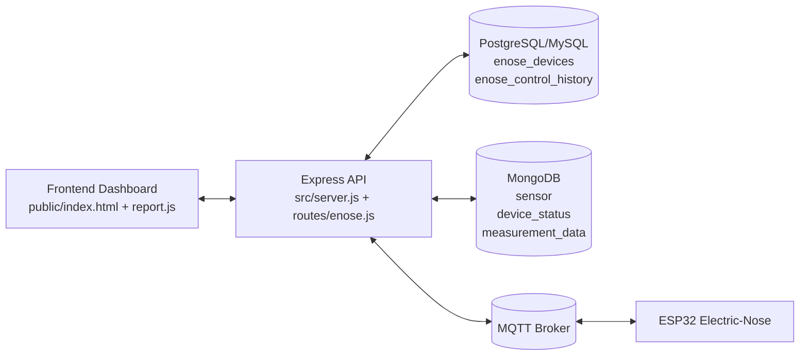
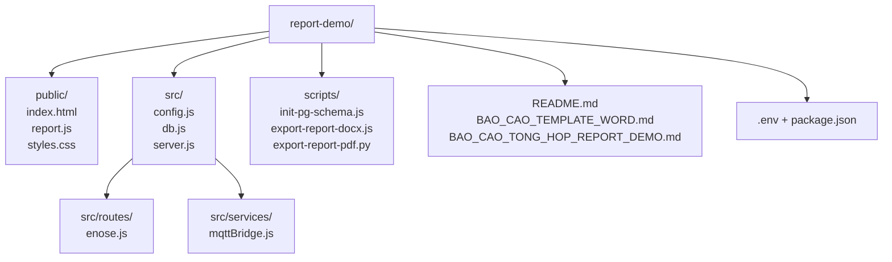
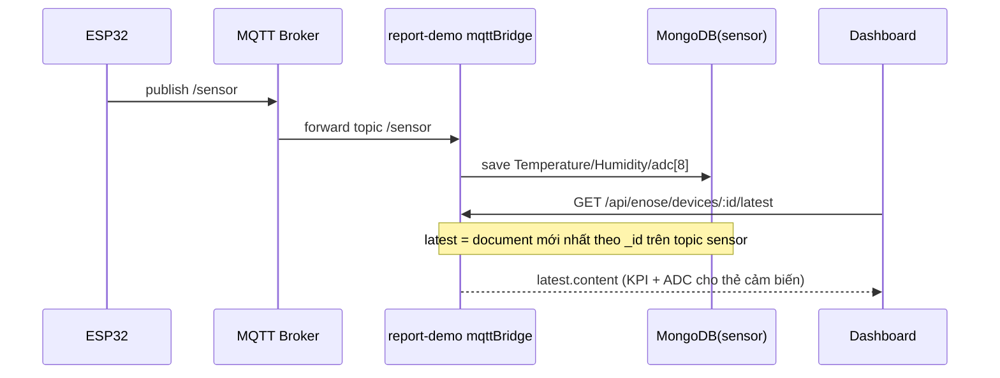
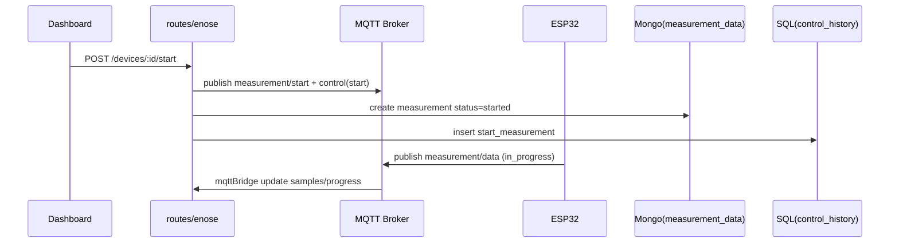
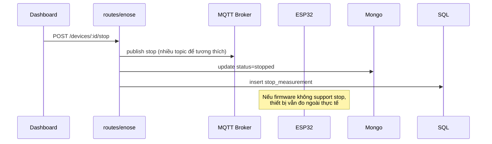

# BÁO CÁO TỔNG HỢP DỰ ÁN REPORT-DEMO

## 0. Checklist trình bày (trước buổi báo cáo)

1. Điền **trang bìa + phân công** trong `BAO_CAO_TEMPLATE_WORD.md`, chèn **Hình PH** (phần cứng), **Hình PM** (kiến trúc phần mềm), ảnh chụp màn hình dashboard / tab Biểu đồ (nhiệt độ–ẩm + **8 kênh ADC**), tab Lịch sử, CRUD kênh.
2. Chạy `npm run export:docx` để xuất Word (đóng file `.docx` cũ nếu đang mở).
3. Chuẩn bị demo: broker + DB trong `.env`, thiết bị online; nêu rõ **polling ~10s** và nguồn dữ liệu: KPI/sparkline từ **`GET .../latest`**, biểu đồ dài từ **`GET .../history`**.
4. **Không** chiếu hay đính kèm file `.env` thật (mật khẩu, broker) — dùng ví dụ đã che trong tài liệu.

## 1. Thông tin chung

- **Tên dự án:** AirSENSE Electric-Nose Report Demo (`report-demo`)
- **Mục tiêu:** Xây dựng hệ thống standalone (chạy 1 folder) để giám sát, điều khiển và báo cáo thiết bị ESP32 Electric-Nose.
- **Phạm vi:** Frontend dashboard + Backend API + MQTT bridge + SQL + MongoDB.
- **Đối tượng sử dụng:** Kỹ sư vận hành, nhóm demo/thuyết trình, nhóm phát triển.

## 2. Bài toán và yêu cầu

### 2.1 Bài toán
- Hệ thống cần hiển thị dữ liệu sensor realtime (Temperature, Humidity, MEMS).
- Cần gửi lệnh điều khiển thiết bị qua MQTT (start/heating/air_pump/stop).
- Cần lưu vết thao tác, quản lý thiết bị, tổng hợp dữ liệu cho báo cáo.

### 2.2 Yêu cầu kỹ thuật đã đạt
- Chạy độc lập 1 folder `report-demo`.
- Cấu hình linh hoạt qua `.env` (DB, Mongo, MQTT).
- Hỗ trợ SQL client `pg` và `mysql`.
- Kiến trúc tách lớp rõ ràng (`src/`, `public/`, `scripts/`).

## 3. Tổng quan kiến trúc



### 3.1 Kiến trúc logic
- **Presentation layer:** giao diện dashboard, chart, KPI, thao tác start/stop.
- **Application layer:** API REST xử lý logic nghiệp vụ.
- **Integration layer:** MQTT bridge đồng bộ dữ liệu và command.
- **Data layer:** SQL lưu metadata + history command, Mongo lưu telemetry/time-series.

## 4. Cấu trúc thư mục (Mermaid)



## 5. Phân tích thành phần chi tiết

### 5.1 Backend core
- `src/server.js`
  - Khởi tạo Express.
  - Mount static frontend (`public/`).
  - Khởi tạo DB + MQTT bridge.
  - Mount API `/api/enose`.

- `src/config.js`
  - Đọc `.env`, parse và chuẩn hóa biến cấu hình.
  - Gom 3 nhóm biến: SQL, Mongo, MQTT.

- `src/db.js`
  - Khởi tạo `knex` theo `DB_CLIENT` (`pg`/`mysql`).
  - Khởi tạo model Mongo:
    - `device_status`
    - `measurement_data`
    - `sensor`
  - Kết nối Mongo có `authSource`.

- `src/services/mqttBridge.js`
  - Subscribe:
    - `electric-nose/device/+/status`
    - `electric-nose/device/+/sensor` (và biến thể topic tương thích; chuẩn hóa lưu Mongo về `.../sensor`)
    - `electric-nose/device/+/measurement/data`
  - Parse payload JSON (nhiệt độ, độ ẩm, mảng **`adc`** hoặc `ADC0…7`, v.v.), ghi document Mongo; trường **`time`** dùng **thời điểm máy chủ nhận** để thứ tự `sort`/`limit` khớp luồng thực tế; có thể lưu thêm `content.firmware_timestamp` nếu firmware gửi `timestamp`.
  - Upsert danh sách thiết bị trong SQL khi cần.

- `src/routes/enose.js`
  - API đọc dữ liệu: devices, latest, status, history, measurements, active, control/status.
  - API điều khiển:
    - `POST /devices/:id/start`
    - `POST /control/measurement/start`
    - `POST /devices/:id/stop`
    - `POST /devices/:id/heating`
    - `POST /devices/:id/air-pump`

### 5.2 Frontend dashboard
- `public/index.html`
  - Điều hướng sidebar (Dashboard, Quản lý thiết bị, Biểu đồ, Lịch sử, Cài đặt); layout responsive; ô `fromTime`/`toTime` ẩn phục vụ JS (cửa sổ 24h).
- `public/report.js`
  - Polling ~**10s** (`latest`, `status`, measurements, biểu đồ qua `history`).
  - KPI + **sparkline ngắn** (buffer cục bộ ~20 điểm) từ **`GET .../latest`**; biểu đồ Chart.js: **nhiệt độ/ẩm** và **8 đường ADC** (EtOH1–6, VOC1–2) từ **`GET .../history`**; truy vấn history cho biểu đồ gửi **`from` + `limit`** (không gửi `to`) để không loại mẫu trong cùng phút do `datetime-local`.
  - Khối **file đo mới nhất** (tên chuẩn, tải/xóa, link máy chủ file theo IP khi có).
  - CRUD kênh SQL; gửi lệnh start/stop/heating/pump.
- `public/styles.css`
  - Theme dashboard, sidebar, dark mode, card MEMS.

## 6. Luồng dữ liệu và xử lý

### 6.1 Luồng sensor realtime



### 6.2 Luồng Start measurement



### 6.3 Luồng Stop measurement (hiện tại)



## 7. Tích hợp cơ sở dữ liệu

### 7.1 SQL (PostgreSQL hiện hành)
- Các bảng chính:
  - `enose_devices`
  - `enose_control_history`
  - `enose_sensor_channels` — cấu hình nhãn/unit/thứ tự hiển thị cho từng `channel_index` (0..31), map với ADC trên dashboard
- Script khởi tạo nhanh: `scripts/init-pg-schema.js`

### 7.2 MongoDB
- Collections sử dụng:
  - `sensor` (time-series sensor)
  - `device_status`
  - `measurement_data`

## 8. MQTT topics (map với WebManage_test)

### 8.1 Topics subscribe
- `electric-nose/device/+/status`
- `electric-nose/device/+/sensor`
- `electric-nose/device/+/measurement/data`

### 8.2 Topics publish command
- Start:
  - `electric-nose/device/{id}/measurement/start`
  - fallback: `electric-nose/device/{id}/control`
- Stop:
  - `electric-nose/device/{id}/measurement/stop`
  - `electric-nose/device/{id}/control`
  - `electric-nose/device/{id}/control/measure`
  - failsafe pump off:
    - `electric-nose/device/{id}/settings/air_pump`
    - `electric-nose/device/{id}/control/pump`

## 9. Kết quả hiện tại

### 9.1 Đạt được
- Hệ thống chạy độc lập 1 folder.
- Kết nối SQL + Mongo + MQTT thành công.
- Dashboard hiển thị sensor realtime (KPI/sparkline từ `latest`; xu hướng dài từ `history`).
- Biểu đồ **8 kênh ADC** cùng tab với nhiệt độ/ẩm; đồng bộ payload MQTT → Mongo (`adc`, topic chuẩn).
- API start/stop có phản hồi, log lịch sử command đầy đủ.

### 9.2 Vấn đề tồn đọng
- Firmware ESP32 hiện tại có dấu hiệu chưa xử lý lệnh stop đầy đủ.
- Vì vậy có thể xảy ra trường hợp:
  - backend đã đánh dấu `stopped`,
  - nhưng thiết bị ngoài thực tế vẫn tiếp tục đo.

## 10. Đề xuất hoàn thiện

### 10.1 Ngắn hạn
- Xác định chính xác topic/payload stop mà firmware đang support.
- Thêm ACK topic từ ESP32 sau khi nhận stop.
- UI hiển thị trạng thái `Stopping...` -> `Stopped` theo ACK thật.

### 10.2 Trung hạn
- Tách service command queue + retry.
- Bổ sung auth token cho API điều khiển.
- Thêm module export báo cáo CSV/PDF theo khoảng thời gian.

### 10.3 Dài hạn
- Chuẩn hóa schema events và observability (trace command -> ack -> result).
- Đồng bộ 1 bộ giao thức MQTT versioned giữa backend và firmware.

## 11. Hướng dẫn vận hành nhanh

### 11.1 Khởi tạo schema SQL
```bash
node scripts/init-pg-schema.js
```

### 11.2 Chạy hệ thống
```bash
npm install
npm start
```

### 11.3 URL
- `http://127.0.0.1:3010`

## 12. Phụ lục: Environment (mẫu — không điền mật khẩu thật khi nộp/trình chiếu)

```env
DB_CLIENT=pg
DB_HOST=127.0.0.1
DB_PORT=5432
DB_USER=your_db_user
DB_PASSWORD=your_db_password
DB_NAME=electricnose

APP_MONGO=mongodb://127.0.0.1
APP_MONGO_PORT=27017
APP_MONGO_USER=your_mongo_user
APP_MONGO_PASSWORD=your_mongo_password
MONGO_AUTH_SOURCE=admin

MQTT_BROKER_URL=mqtt://your-broker:1883
MQTT_USERNAME=your_mqtt_user
MQTT_PASSWORD=your_mqtt_password
```

Giá trị thực tế chỉ lưu trong `.env` cục bộ, **không** commit vào git và **không** dán vào slide/báo cáo.

## 13. Phụ lục: Phân chia công việc cá nhân (50-25-25)

| Thành viên | Tỷ lệ đóng góp | Vai trò chính | Hạng mục phụ trách | Mức độ kỹ thuật |
| --- | --- | --- | --- | --- |
| Nguyễn Nhật Bảo | 50% | Nhóm trưởng / Backend chính | Kiến trúc tổng thể, API `enose`, tích hợp MQTT bridge với SQL/Mongo, xử lý luồng điều khiển start/stop/heating/pump, trình bày phần kỹ thuật phức tạp | Cao |
| Dương Huyền Ninh | 25% | Frontend / UI | Sidebar, dashboard, biểu đồ Chart.js, tab Lịch sử, tối ưu luồng hiển thị và kiểm thử thao tác người dùng | Trung bình |
| Hồ Nguyễn Huyền Diệu | 25% | Triển khai + QA + Tài liệu | Cài đặt môi trường, script chạy demo, chuẩn bị dữ liệu mẫu, tổng hợp kết quả kiểm thử và minh chứng, mô tả CSDL cơ bản, viết phần kết luận và hướng phát triển | Trung bình |

**Ghi chú nghiệm thu:** Tỷ lệ 50% dành cho phần lõi kỹ thuật và tích hợp nhiều thành phần. Hai phần 25% còn lại là các cụm công việc độc lập, có đầu ra rõ ràng bằng giao diện, checklist chạy thử, minh chứng test và nội dung tài liệu.

---

**Kết luận:** `report-demo` đã đạt mục tiêu "standalone dashboard + backend". Để hoàn tất nghiệp vụ "Stop đo thật", cần cập nhật firmware ESP32 theo giao thức stop thống nhất.
