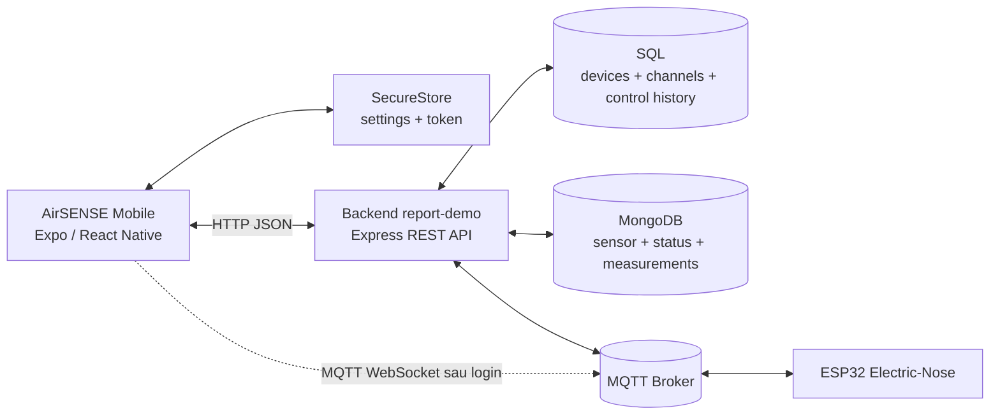
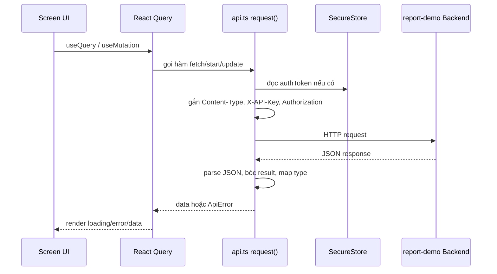

# BÁO CÁO TỔNG QUAN MOBILE APP - AIRSENSE

## 1. Thông tin chung

- **Tên module:** AirSENSE Mobile (`mobile-app`)
- **Loại ứng dụng:** Ứng dụng di động đa nền tảng phát triển bằng Expo / React Native
- **Mục tiêu:** Cung cấp giao diện mobile để theo dõi dữ liệu Electric-Nose, điều khiển thiết bị và quản lý cấu hình kênh cảm biến khi không dùng dashboard web.
- **Phạm vi:** Mobile client kết nối tới backend `report-demo` qua REST API, lưu cấu hình cục bộ bằng `expo-secure-store`, hỗ trợ xác thực người dùng và một kết nối MQTT WebSocket sau đăng nhập.
- **Nền tảng chạy:** Expo Go trên Android/iOS; có thể mở rộng sang development build nếu sau này cần native module ngoài Expo Go.

## 2. Mục tiêu và vai trò trong hệ thống

Mobile app đóng vai trò là lớp giao diện vận hành trên điện thoại cho hệ thống AirSENSE. Thay vì người dùng phải mở dashboard web trên máy tính, ứng dụng cho phép:

- Xem nhanh nhiệt độ, độ ẩm, Wi-Fi, trạng thái đo và 8 kênh ADC.
- Chọn thiết bị đang vận hành.
- Bắt đầu / dừng phiên đo.
- Bật / tắt heating và air pump.
- Xem biểu đồ lịch sử 24 giờ và bảng lịch sử mẫu đo.
- Quản lý CRUD cấu hình kênh cảm biến trong bảng SQL `enose_sensor_channels`.
- Cấu hình URL server, API key và chu kỳ refresh trực tiếp trên app.

Ứng dụng không thay thế backend. Toàn bộ dữ liệu chính vẫn đi qua REST API của `report-demo`; mobile app là client đọc dữ liệu đã được backend chuẩn hóa từ SQL, MongoDB và MQTT bridge.

## 3. Công nghệ sử dụng

| Nhóm | Công nghệ / thư viện | Vai trò |
| --- | --- | --- |
| Framework | Expo `~54.0.0`, React Native `0.81.5`, React `19.1.0` | Nền tảng xây dựng app mobile |
| Điều hướng | `expo-router`, `@react-navigation/bottom-tabs` | Stack đăng nhập / đăng ký và 5 tab chính |
| Data fetching | `@tanstack/react-query` | Polling, cache, mutation và refetch dữ liệu |
| Lưu cục bộ | `expo-secure-store` | Lưu server URL, API key, refresh interval, selected device, auth token |
| Biểu đồ | `react-native-svg` | Vẽ line chart trong Expo Go |
| MQTT | `mqtt` qua WebSocket | Kết nối sau đăng nhập, subscribe topic theo `deviceId` |
| Ngôn ngữ | TypeScript strict mode | Kiểm soát kiểu dữ liệu và giảm lỗi runtime |

## 4. Kiến trúc tổng quan



### 4.1 Luồng đọc dữ liệu

1. ESP32 publish dữ liệu sensor/status/measurement lên MQTT broker.
2. Backend `mqttBridge` nhận message, parse payload và lưu vào MongoDB/SQL.
3. Mobile app gọi REST API theo chu kỳ `refreshMs`.
4. React Query cache dữ liệu và tự cập nhật các màn hình Dashboard, Charts, History, Devices.

### 4.2 Luồng điều khiển

1. Người dùng bấm Start/Stop hoặc bật Heating/Air pump trên mobile.
2. App gọi REST API tương ứng.
3. Backend ghi lịch sử điều khiển và publish lệnh MQTT xuống thiết bị.
4. App refetch trạng thái để đồng bộ UI với dữ liệu backend.

## 5. Cấu trúc thư mục chính

```text
mobile-app/
  src/
    app/
      _layout.tsx
      login.tsx
      register.tsx
      (tabs)/
        index.tsx
        charts.tsx
        history.tsx
        devices.tsx
        settings.tsx
    components/
      AppNavigator.tsx
      line-chart.tsx
      ui.tsx
    providers/
      auth-provider.tsx
      settings-provider.tsx
    lib/
      api.ts
      mqtt.ts
      sensor.ts
      format.ts
      types.ts
    constants/
      airsense.ts
  assets/
  app.json
  package.json
  tsconfig.json
```

| File / thư mục | Vai trò |
| --- | --- |
| `src/app/_layout.tsx` | Bọc app bằng `SettingsProvider`, `AuthProvider`, `QueryClientProvider` và navigator chính |
| `src/components/AppNavigator.tsx` | Chọn stack đăng nhập/đăng ký hoặc stack tab chính dựa trên trạng thái login |
| `src/providers/settings-provider.tsx` | Lưu và suy luận `effectiveBaseUrl`, API key, refresh interval, selected device |
| `src/providers/auth-provider.tsx` | Đăng nhập, đăng ký, đăng xuất, lưu token, khởi tạo/ngắt MQTT |
| `src/lib/api.ts` | Lớp client gọi REST API, map dữ liệu backend sang type mobile |
| `src/lib/sensor.ts` | Chuẩn hóa cách đọc Temperature, Humidity, `adc[]`, `ADC0..7` và timestamp |
| `src/lib/mqtt.ts` | Kết nối MQTT WebSocket, subscribe/publish và reconnect |
| `src/app/(tabs)/index.tsx` | Dashboard realtime và điều khiển thiết bị |
| `src/app/(tabs)/charts.tsx` | Biểu đồ 24 giờ cho môi trường và 8 kênh ADC |
| `src/app/(tabs)/history.tsx` | Bảng 120 mẫu sensor gần nhất |
| `src/app/(tabs)/devices.tsx` | CRUD cấu hình kênh cảm biến SQL |
| `src/app/(tabs)/settings.tsx` | Cấu hình URL server, API key, refresh interval, test connection, logout |

## 6. Các màn hình và chức năng

### 6.1 Đăng nhập và đăng ký

App có hai màn hình xác thực:

- `login.tsx`: nhập username/password, gọi `POST /api/auth/login`, lưu `authToken` và `authDeviceId` vào SecureStore.
- `register.tsx`: kiểm tra dữ liệu đầu vào, gọi `POST /api/auth/register`, sau đó tự đăng nhập.

Sau khi có token, `AuthProvider` gọi `initMqtt(token, deviceId)` để tạo kết nối MQTT WebSocket. Các request REST sau đó tự gắn header:

- `Authorization: Bearer <token>`
- `X-API-Key: <apiKey>` nếu người dùng cấu hình API key.

### 6.2 Dashboard

Màn hình Dashboard là màn hình vận hành chính, gồm:

- Chọn thiết bị từ danh sách `GET /api/enose/devices`.
- KPI realtime: Temperature, Humidity, Wi-Fi RSSI.
- Điều khiển Start measurement và Stop measurement.
- Công tắc Heating và Air pump.
- Lưới 8 kênh ADC: EtOH1-6, VOC1-2.
- Tóm tắt trạng thái điều khiển: tổng thiết bị, online, offline, số lệnh gần đây.
- Trạng thái phiên đo hiện tại: tên file, status, số mẫu, thời điểm bắt đầu.

Các công tắc Heating/Air pump dùng cơ chế optimistic trong tối đa 25 giây để UI phản hồi ngay, sau đó refetch trạng thái từ server.

### 6.3 Charts

Màn hình Charts lấy dữ liệu lịch sử 24 giờ gần nhất:

- Gọi `GET /api/enose/devices/:id/history?from=<iso>&limit=120`.
- Vẽ biểu đồ Temperature/Humidity.
- Vẽ biểu đồ 8 kênh ADC từ cùng payload Mongo.
- Dùng `react-native-svg`, phù hợp Expo Go, không cần native chart module.

### 6.4 History

Màn hình History hiển thị 120 mẫu sensor mới nhất:

- Thời gian mẫu đo.
- Temperature.
- Humidity.
- Tóm tắt ADC theo dạng min / avg / max.

Cách hiển thị này phù hợp mobile vì không đưa đủ 8 giá trị ADC vào một hàng quá hẹp.

### 6.5 Devices / Sensor Channels

Màn hình Devices tập trung vào CRUD bảng SQL `enose_sensor_channels`:

- Đọc danh sách kênh theo thiết bị.
- Thêm kênh mới với `channel_index`, `label`, `unit`, `sort_order`.
- Sửa kênh bằng modal.
- Xóa mềm kênh qua endpoint delete.

Nếu backend cũ chưa có endpoint `sensor-channels`, app có fallback 8 kênh mặc định: EtOH1-6 và VOC1-2.

### 6.6 Settings

Màn hình Settings quản lý cấu hình kết nối:

- Server URL, ví dụ `http://192.168.x.x:3010`.
- API key nếu backend bật `APP_API_KEY`.
- Refresh interval, tối thiểu 2000 ms.
- Test connection qua `GET /api/health` và `GET /config.json`.
- Hiển thị `effectiveBaseUrl` đang được app sử dụng.
- Đăng xuất và xóa token khỏi SecureStore.

Nếu người dùng chưa nhập server URL, app ưu tiên:

1. `EXPO_PUBLIC_API_BASE_URL`
2. Host IP suy luận từ Expo Go
3. URL lưu trong Settings nếu đã có

## 7. Phần Data trong mobile app

### 7.1 Nguồn dữ liệu

Mobile app không lưu dữ liệu đo chính trong máy người dùng. Dữ liệu nghiệp vụ được lấy từ backend `report-demo`, trong đó backend tổng hợp từ ba nguồn:

| Nguồn | Dữ liệu | Mobile app sử dụng ở đâu |
| --- | --- | --- |
| SQL | Danh sách thiết bị, cấu hình kênh cảm biến, lịch sử điều khiển | Device picker, Devices tab, nhãn 8 kênh ADC |
| MongoDB | Sensor realtime, status thiết bị, measurement session | Dashboard, Charts, History, Measurement state |
| MQTT Broker | Dữ liệu ESP32 và lệnh điều khiển thiết bị | Backend xử lý chính; mobile có kết nối MQTT sau login để mở rộng realtime |

Vì mobile lấy dữ liệu qua REST API, app tránh kết nối trực tiếp vào SQL/MongoDB. Cách này phù hợp hơn cho bảo mật, dễ triển khai trên điện thoại và giữ backend là nơi chuẩn hóa dữ liệu.

### 7.2 Kiểu dữ liệu chính trong app

Các type chính nằm trong `src/lib/types.ts` và được map ở `src/lib/api.ts`:

| Type | Ý nghĩa |
| --- | --- |
| `Device` | Thiết bị AirSENSE đọc từ SQL, gồm `deviceCode`, `deviceId`, `status`, `lastSeen` |
| `SensorDoc` | Một bản ghi sensor từ MongoDB, chứa `content`, `time`, `createdAt`, `updatedAt` |
| `DeviceStatus` | Trạng thái thiết bị: Wi-Fi, heating, air pump, storage, last seen |
| `Measurement` | Phiên đo: tên file, trạng thái, số mẫu, thời điểm bắt đầu/kết thúc |
| `Channel` | Cấu hình kênh cảm biến SQL: `channelIndex`, `label`, `unit`, `sortOrder` |
| `PersistedSettings` | Cấu hình lưu cục bộ: `baseUrl`, `apiKey`, `refreshMs`, `selectedDevice` |

### 7.3 Chuẩn hóa dữ liệu sensor

Payload sensor từ firmware/backend có thể không cố định hoàn toàn, nên app có lớp chuẩn hóa trong `src/lib/sensor.ts`:

- Đọc nhiệt độ theo cả `Temperature` và `temperature`.
- Đọc độ ẩm theo cả `Humidity` và `humidity`.
- Đọc ADC theo nhiều dạng: `adc[]`, `ADC0..ADC7`, `adc0..adc7`.
- Đọc kênh theo nhãn SQL như `EtOH1`, `EtOH2`, `VOC1`, `VOC2`.
- Chuẩn hóa timestamp từ `time`, `createdAt` hoặc `updatedAt`.
- Tóm tắt ADC trong History bằng min / avg / max để phù hợp màn hình điện thoại.

Nhờ lớp này, UI không phải xử lý trực tiếp nhiều biến thể payload. Khi firmware hoặc backend thay đổi tên trường nhỏ, chỉ cần cập nhật `sensor.ts` thay vì sửa từng màn hình.

### 7.4 Data fetching và cache

Mobile app dùng TanStack Query để quản lý dữ liệu:

- `useQuery` cho dữ liệu đơn như devices, history, channels.
- `useQueries` ở Dashboard để tải song song latest, status, active measurement và control summary.
- `useMutation` cho các thao tác ghi như start, stop, heating, air pump, create/update/delete channel.
- `refetchInterval: settings.refreshMs` để polling tự động theo cấu hình người dùng.
- `queryKey` có chứa `effectiveBaseUrl`, `apiKey`, `selectedDevice` để tránh dùng cache sai server hoặc sai thiết bị.

### 7.5 Dữ liệu lưu cục bộ

App chỉ lưu các dữ liệu cấu hình và phiên đăng nhập trong `expo-secure-store`:

| Key | Nội dung |
| --- | --- |
| `airsense-mobile-settings` | Server URL, API key, refresh interval, selected device |
| `authToken` | Token sau đăng nhập |
| `authDeviceId` | Device/user id trả về từ backend |

Không lưu trực tiếp dữ liệu sensor dài hạn trên mobile. Điều này giúp giảm rủi ro lệch dữ liệu giữa điện thoại và server, đồng thời tránh tăng dung lượng app khi hệ thống đo liên tục.

### 7.6 Luồng dữ liệu theo màn hình

| Màn hình | Dữ liệu đọc | Dữ liệu ghi |
| --- | --- | --- |
| Login/Register | Không đọc sensor; gọi API auth | Ghi token/deviceId vào SecureStore |
| Dashboard | Devices, latest sensor, status, active measurement, control summary | Start/Stop, Heating, Air pump, selected device |
| Charts | History 24h, tối đa 120 mẫu | Không ghi dữ liệu nghiệp vụ |
| History | 120 mẫu sensor gần nhất | Không ghi dữ liệu nghiệp vụ |
| Devices | Danh sách sensor channels | Create/Update/Delete channel |
| Settings | Health, config, settings local | Server URL, API key, refresh interval, logout |

## 8. Middleware và lớp trung gian

Trong phạm vi mobile app, "middleware" được hiểu là các lớp nằm giữa UI và backend, giúp xử lý cấu hình, xác thực, request, cache và điều hướng. Ngoài ra, backend `report-demo` vẫn có middleware Express và MQTT bridge để phục vụ dữ liệu cho mobile.

### 8.1 Middleware phía mobile

| Lớp | File | Vai trò |
| --- | --- | --- |
| Settings provider | `src/providers/settings-provider.tsx` | Tải/lưu cấu hình, suy luận `effectiveBaseUrl`, đảm bảo refresh interval tối thiểu |
| Auth provider | `src/providers/auth-provider.tsx` | Quản lý login/register/logout, lưu token, khởi tạo/ngắt MQTT |
| API wrapper | `src/lib/api.ts` | Chuẩn hóa URL, gắn header, parse JSON, bóc `result`, chuyển lỗi thành `ApiError` |
| React Query | `@tanstack/react-query` | Cache, polling, retry, mutation, refetch sau thao tác ghi |
| App navigator | `src/components/AppNavigator.tsx` | Chặn người dùng chưa login vào tab chính |
| Sensor parser | `src/lib/sensor.ts` | Middleware dữ liệu giữa payload backend và UI hiển thị |

### 8.2 Luồng request qua middleware mobile



### 8.3 Xác thực và bảo vệ luồng màn hình

`AuthProvider` là lớp trung gian quan trọng:

- Khi mở app, provider đọc `authToken` và `authDeviceId` từ SecureStore.
- Nếu có token, app coi người dùng đã đăng nhập và hiển thị tab chính.
- Nếu chưa có token, `AppNavigator` chỉ hiển thị Login/Register.
- Khi login thành công, token được lưu và request REST sau đó tự gắn `Authorization: Bearer <token>`.
- Khi logout, app ngắt MQTT, xóa token và quay lại luồng xác thực.

Cách này giúp từng màn hình chức năng không cần tự kiểm tra token, tránh lặp logic xác thực trong Dashboard, Charts, History hoặc Devices.

### 8.4 Middleware request và xử lý lỗi

Hàm `request()` trong `src/lib/api.ts` đóng vai trò giống middleware cho toàn bộ API call:

- Chuẩn hóa `baseUrl`, tránh lỗi thừa/thiếu dấu `/`.
- Tự thêm `Content-Type: application/json` khi có body.
- Tự thêm `X-API-Key` nếu người dùng cấu hình.
- Tự đọc `authToken` và thêm `Authorization`.
- Bắt lỗi mạng và chuyển thành thông báo dễ hiểu.
- Kiểm tra JSON response hợp lệ.
- Nếu backend trả dữ liệu trong object `result`, app tự bóc ra để tương thích nhiều kiểu response.

Phần `userMessageFromError()` tiếp tục chuyển lỗi kỹ thuật thành câu dễ hiểu cho UI, ví dụ sai URL server, mất mạng, thiết bị không tồn tại hoặc endpoint 404.

### 8.5 Middleware phía backend liên quan tới mobile

Mobile app phụ thuộc vào một số lớp trung gian ở backend:

| Backend middleware / service | Vai trò với mobile app |
| --- | --- |
| `express.json()` | Parse body JSON cho login, register, heating, air pump, CRUD channel |
| Static/config route | Cung cấp `/config.json` để mobile kiểm tra cấu hình công khai |
| API router `/api/enose` | Chuẩn hóa REST API cho thiết bị, sensor, measurement và channel |
| MQTT bridge | Nhận message từ ESP32, lưu Mongo/SQL để mobile đọc qua REST |
| DB layer | Kết nối SQL/MongoDB, giữ mobile không cần truy cập DB trực tiếp |
| Auth middleware nếu bật | Kiểm tra Bearer token hoặc API key trước khi cho thao tác điều khiển |

### 8.6 Lý do cần các lớp middleware này

- UI mobile gọn hơn vì không chứa logic parse token, normalize URL, parse sensor payload ở từng màn hình.
- Backend vẫn là lớp bảo vệ dữ liệu và thiết bị, tránh để app mobile kết nối trực tiếp SQL/MongoDB/MQTT broker nội bộ.
- Dễ thay đổi contract: nếu backend đổi wrapper response hoặc firmware đổi tên trường ADC, chỉ cần sửa `api.ts` hoặc `sensor.ts`.
- Dễ mở rộng bảo mật: có thể thêm refresh token, role, permission hoặc kiểm tra API key mà không cần viết lại toàn bộ UI.

## 9. API backend đang sử dụng

| Chức năng | Endpoint |
| --- | --- |
| Cấu hình công khai | `GET /config.json` |
| Kiểm tra sức khỏe hệ thống | `GET /api/health` |
| Đăng nhập | `POST /api/auth/login` |
| Đăng ký | `POST /api/auth/register` |
| Danh sách thiết bị | `GET /api/enose/devices` |
| Dữ liệu sensor mới nhất | `GET /api/enose/devices/:id/latest` |
| Trạng thái thiết bị | `GET /api/enose/devices/:id/status` |
| Lịch sử sensor | `GET /api/enose/devices/:id/history` |
| Danh sách phiên đo | `GET /api/enose/devices/:id/measurements` |
| Phiên đo đang chạy | `GET /api/enose/devices/measurements/active` |
| Tổng quan điều khiển | `GET /api/enose/control/status` |
| Start đo | `POST /api/enose/control/measurement/start` |
| Stop đo | `POST /api/enose/control/measurement/stop` |
| Heating | `POST /api/enose/devices/:id/heating` |
| Air pump | `POST /api/enose/devices/:id/air-pump` |
| Đọc kênh cảm biến | `GET /api/enose/devices/:id/sensor-channels` |
| Tạo kênh cảm biến | `POST /api/enose/devices/:id/sensor-channels` |
| Sửa kênh cảm biến | `PATCH /api/enose/sensor-channels/:channelId` |
| Xóa mềm kênh cảm biến | `POST /api/enose/sensor-channels/:channelId/delete` |

## 10. Luồng demo đề xuất

| Bước | Màn hình | Thao tác | Kết quả cần trình bày |
| --- | --- | --- | --- |
| 1 | Settings | Nhập Server URL, bấm Test connection | App báo trạng thái Mongo/PG/MQTT và cấu hình API |
| 2 | Login | Đăng nhập tài khoản demo | App vào màn hình tab chính |
| 3 | Dashboard | Chọn thiết bị | KPI và trạng thái thiết bị hiển thị |
| 4 | Dashboard | Bấm Start measurement | Backend tạo phiên đo, app cập nhật measurement state |
| 5 | Dashboard | Bật Heating/Air pump | Công tắc đổi trạng thái, server nhận lệnh |
| 6 | Charts | Mở tab biểu đồ | Hiển thị xu hướng Temperature/Humidity và 8 ADC |
| 7 | History | Mở tab lịch sử | Bảng 120 mẫu gần nhất, ADC được tóm tắt |
| 8 | Devices | Thêm/sửa/xóa một kênh cảm biến | Chứng minh CRUD trên SQL |
| 9 | Dashboard | Bấm Stop measurement | Kết thúc phiên đo, trạng thái được refetch |
| 10 | Settings | Logout | Token bị xóa, quay về luồng xác thực |

## 11. Kết quả đã đạt được

- App Expo chạy được trên điện thoại qua Expo Go.
- Có phân luồng xác thực: chưa login thì vào Login/Register, đã login thì vào tab chính.
- Lưu được cấu hình quan trọng bằng SecureStore.
- Tự suy luận URL backend trong môi trường Expo Go, đồng thời cho phép nhập URL thủ công.
- Có 5 tab chức năng tương đương dashboard web: Dashboard, Charts, History, Devices, Settings.
- Tích hợp React Query để polling và refetch dữ liệu có kiểm soát.
- Đọc được dữ liệu sensor theo nhiều dạng payload: `Temperature`, `temperature`, `Humidity`, `humidity`, `adc[]`, `ADC0..7`, `adc0..7`.
- Có CRUD kênh cảm biến để đáp ứng yêu cầu thao tác CSDL.
- Có kết nối MQTT WebSocket sau đăng nhập, chuẩn bị cho các chức năng realtime mở rộng.

## 12. Hạn chế hiện tại

- App vẫn phụ thuộc backend `report-demo`; nếu backend thiếu endpoint `api/auth/*` hoặc `control/measurement/*` thì chức năng đăng nhập/start/stop sẽ lỗi.
- MQTT trong mobile hiện mới khởi tạo kết nối và subscribe topic theo `deviceId`; phần hiển thị realtime chính vẫn dựa vào REST polling.
- URL MQTT mặc định là `ws://localhost:8083/mqtt`, không phù hợp khi chạy trên điện thoại thật nếu chưa cấu hình `EXPO_PUBLIC_MQTT_BROKER_URL`.
- Một số chuỗi tiếng Việt trong mã nguồn đang có dấu hiệu lỗi mã hóa khi đọc bằng PowerShell, nên cần chuẩn hóa UTF-8 để tránh hiển thị sai trong app hoặc báo cáo.
- Chưa có test tự động cho màn hình và API client.
- Chưa có cơ chế role/permission chi tiết cho từng thao tác điều khiển.

## 13. Đề xuất hoàn thiện

### Ngắn hạn

- Đồng bộ lại contract backend cho `api/auth/login`, `api/auth/register`, `api/enose/control/measurement/start`, `api/enose/control/measurement/stop`.
- Chuẩn hóa toàn bộ file TypeScript/Markdown sang UTF-8.
- Cấu hình rõ `EXPO_PUBLIC_API_BASE_URL` và `EXPO_PUBLIC_MQTT_BROKER_URL` trong tài liệu chạy demo.
- Kiểm thử lại trên điện thoại thật cùng mạng LAN với backend.

### Trung hạn

- Dùng MQTT/WebSocket hoặc SSE để đẩy dữ liệu realtime thay vì chỉ polling REST.
- Thêm trạng thái kết nối MQTT vào UI.
- Thêm toast/thông báo rõ ràng cho lỗi mạng, lỗi token hết hạn, lỗi thiết bị offline.
- Bổ sung test cho `sensor.ts`, `api.ts` và các flow Start/Stop/CRUD.

### Dài hạn

- Đóng gói bằng Expo development build hoặc EAS Build.
- Bổ sung phân quyền người dùng: viewer/operator/admin.
- Thêm export CSV/PDF trên mobile.
- Thêm cảnh báo ngưỡng sensor và push notification.

## 14. Kết luận

`mobile-app` đã đạt vai trò của một client vận hành mobile cho hệ thống AirSENSE. Ứng dụng có đầy đủ các phần quan trọng: xác thực, cấu hình kết nối, dashboard realtime qua polling, biểu đồ, lịch sử, điều khiển thiết bị và CRUD kênh cảm biến. So với dashboard web, mobile app phù hợp hơn cho thao tác nhanh tại hiện trường, đặc biệt khi kỹ thuật viên cần kiểm tra thiết bị ESP32, xem dữ liệu sensor và gửi lệnh điều khiển trực tiếp từ điện thoại.

Phần cần ưu tiên hoàn thiện là đồng bộ contract backend cho xác thực/start-stop, chuẩn hóa mã hóa tiếng Việt và nâng cấp luồng realtime từ polling sang push-based để app phản hồi nhanh và đúng trạng thái thiết bị hơn.
