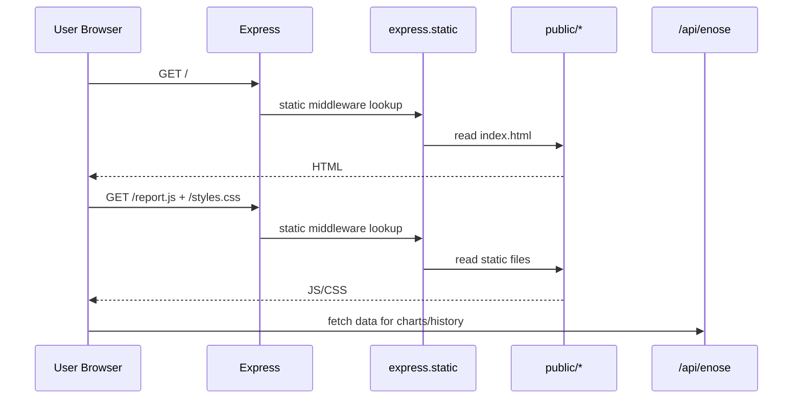

# PHỤ LỤC CÁ NHÂN - DƯƠNG HUYỀN NINH

## 1) Trường hợp cụ thể

**Trường hợp chọn:** Người dùng truy cập dashboard, tải file giao diện và thực hiện xem dữ liệu biểu đồ/lịch sử trên trình duyệt.

**Mục tiêu:** Đảm bảo frontend (`index.html`, `report.js`, `styles.css`) được phục vụ ổn định để các chức năng UI hoạt động trơn tru.

## 2) Middleware / thư viện bên thứ 3 được chọn

### 2.1 Lý do chọn

Chọn middleware **`express.static()`** vì:

- Đây là middleware cốt lõi để phục vụ file tĩnh cho giao diện dashboard.
- Không có nó, UI không thể tải được JS/CSS, dẫn đến không thể thao tác biểu đồ, lịch sử, điều khiển.
- Phù hợp trực tiếp với phần việc frontend và trải nghiệm người dùng.

### 2.2 Vai trò, nhiệm vụ

- Ánh xạ thư mục `public/` thành tài nguyên web truy cập được qua HTTP.
- Trả đúng MIME type cho JS/CSS/HTML để trình duyệt render chính xác.
- Giảm độ phức tạp vì không cần viết route thủ công cho từng file.

### 2.3 Cách dùng trong dự án

```js
app.use(express.static(path.join(__dirname, "..", "public")));
```

- Khi truy cập `/`, server trả `index.html`.
- Trình duyệt tự động gọi thêm `/report.js`, `/styles.css`, ảnh/icon (nếu có).

## 3) Giải thích đường đi từ request đến response

### 3.1 Luồng tải giao diện ban đầu

1. Người dùng mở `http://127.0.0.1:3010`.
2. Express nhận request, middleware `express.static` tìm file trong `public/`.
3. Server trả `index.html`.
4. Trình duyệt đọc HTML rồi gửi thêm request để lấy `report.js` và `styles.css`.
5. Khi JS đã tải xong, frontend bắt đầu gọi API `/api/enose/...` để lấy dữ liệu.

### 3.2 Sơ đồ luồng



### 3.3 Ví dụ request/response

- **Request:** `GET /report.js`
- **Response:** `200 OK` + nội dung file JS.
- Nếu file không tồn tại trong `public/`, middleware cho phép chuyển tiếp để route khác xử lý hoặc trả 404.

## 4) Giải thích vận hành website theo phần việc được phân công

Tập trung phần frontend (dashboard, biểu đồ, lịch sử):

- Sau khi file tĩnh tải thành công, `report.js` khởi tạo view, bind sự kiện nút và gọi API định kỳ.
- Tab Biểu đồ dùng dữ liệu API để render Chart.js (nhiệt độ/độ ẩm + các kênh ADC).
- Tab Lịch sử hiển thị bảng dữ liệu theo bộ lọc thời gian.
- Vì `express.static` ổn định, người dùng không gặp lỗi thiếu tài nguyên (JS/CSS), từ đó trải nghiệm chuyển tab và hiển thị dữ liệu mượt hơn.

## 5) Kết luận cá nhân

`express.static()` tuy đơn giản nhưng là middleware nền tảng cho toàn bộ phần frontend. Nó bảo đảm dashboard luôn có đủ tài nguyên để hoạt động, đáp ứng đúng phần việc UI/UX và trực quan dữ liệu được giao.
