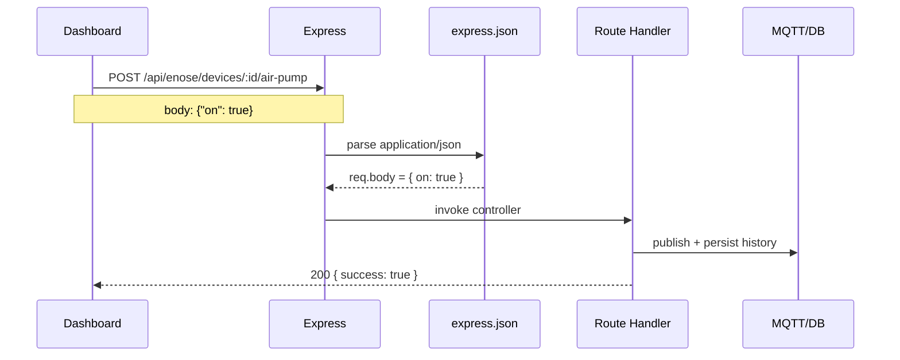

# PHỤ LỤC CÁ NHÂN - HỒ NGUYỄN HUYỀN DIỆU

## 1) Trường hợp cụ thể

**Trường hợp chọn:** Người dùng gửi lệnh điều khiển từ giao diện (ví dụ bật/tắt bơm khí hoặc heating) bằng request `POST` có dữ liệu JSON.

**Mục tiêu:** Đảm bảo server đọc đúng dữ liệu đầu vào, kiểm thử được luồng request-response và ghi lại minh chứng chạy demo.

## 2) Middleware / thư viện bên thứ 3 được chọn

### 2.1 Lý do chọn

Chọn middleware **`express.json()`** vì:

- Đây là middleware bắt buộc cho các API điều khiển dùng body JSON.
- Phù hợp với phần việc triển khai demo và QA: dễ kiểm tra request hợp lệ/không hợp lệ.
- Giúp chuẩn hóa đầu vào trước khi vào handler nghiệp vụ, giảm lỗi do sai định dạng body.

### 2.2 Vai trò, nhiệm vụ

- Parse payload JSON từ HTTP request và gán vào `req.body`.
- Từ `req.body`, route backend mới đọc được tham số như `on`, `duration`, `deviceId`.
- Đặt giới hạn kích thước body (`limit`) để tránh request quá lớn.

### 2.3 Cách dùng trong dự án

```js
app.use(express.json({ limit: "2mb" }));
```

- Tác dụng cho các request có `Content-Type: application/json`.
- Nếu JSON sai cú pháp, Express trả lỗi parse và không cho vào route.

## 3) Giải thích đường đi từ request đến response

### 3.1 Luồng cụ thể với lệnh điều khiển

1. Người dùng bấm nút trên dashboard (ví dụ Air pump ON).
2. Frontend gọi `fetch` tới endpoint điều khiển, kèm body JSON.
3. Request vào Express và đi qua `express.json()`.
4. Middleware parse thành object `req.body`.
5. Route `/api/enose/...` đọc dữ liệu từ `req.body`, thực hiện logic:
   - publish MQTT command,
   - ghi lịch sử SQL/Mongo (nếu có),
   - trả kết quả cho frontend.
6. Frontend nhận JSON response và cập nhật trạng thái giao diện.

### 3.2 Sơ đồ luồng



### 3.3 Ví dụ request/response để kiểm thử

- **Request:** `POST /api/enose/devices/1/air-pump`
  - Header: `Content-Type: application/json`
  - Body: `{ "on": true }`
- **Response mong đợi:** `200` và JSON thành công.
- **Case lỗi QA:** gửi body sai định dạng JSON -> server báo lỗi parse, giúp phát hiện sớm lỗi từ phía client/tool test.

## 4) Giải thích vận hành website theo phần việc được phân công

Phần việc chính của tôi là triển khai demo, QA và tài liệu:

- Chuẩn bị môi trường chạy (`.env`, DB, broker MQTT), kiểm tra endpoint trước giờ demo.
- Thiết kế checklist test cho các lệnh điều khiển có body JSON.
- Thu thập ảnh minh chứng request-response (trình duyệt, network tab, log server).
- Tổng hợp phần mô tả CSDL cơ bản, kết luận và hướng phát triển trong báo cáo.

Với `express.json()`, việc test có cấu trúc rõ ràng:

- Test hợp lệ: body JSON đúng -> API trả thành công.
- Test lỗi: body thiếu trường hoặc sai format -> API phản hồi lỗi tương ứng.
- Từ đó tạo được bằng chứng định lượng cho phần QA trong phụ lục.

## 5) Kết luận cá nhân

`express.json()` là middleware trọng tâm cho luồng điều khiển bằng API trong dự án. Nó giúp phần vận hành demo và kiểm thử đầu vào rõ ràng hơn, giảm lỗi khi trình bày hệ thống trước giảng viên.
