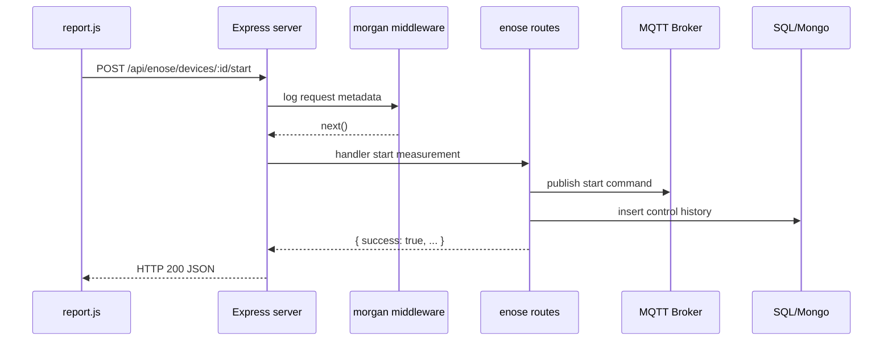

# PHỤ LỤC CÁ NHÂN - NGUYỄN NHẬT BẢO

## 1) Trường hợp cụ thể

**Trường hợp chọn:** Theo dõi và truy vết toàn bộ request API điều khiển thiết bị (`start`, `stop`, `heating`, `air-pump`) để debug nhanh khi thiết bị không phản hồi đúng kỳ vọng.

**Bối cảnh thực tế:** Trong demo Electric-Nose, có lúc người dùng bấm lệnh thành công trên UI nhưng firmware không ACK như mong muốn. Nếu không có log request theo thời gian thực, rất khó kết luận lỗi nằm ở frontend, backend hay firmware.

## 2) Middleware / thư viện bên thứ 3 được chọn

### 2.1 Lý do chọn

Chọn **`morgan`** (HTTP request logger middleware) vì:

- Tạo log đầy đủ theo từng request: IP, method, URL, status code, response time.
- Hữu ích cho phần backend tích hợp MQTT: đối chiếu thời điểm nhận request với thời điểm publish MQTT.
- Dễ tích hợp, không thay đổi logic nghiệp vụ hiện có, rủi ro thấp.
- Phù hợp vai trò người phụ trách phần backend core và tích hợp khó.

### 2.2 Vai trò, nhiệm vụ

- Chèn middleware ở lớp đầu pipeline Express để log toàn bộ request trước khi vào route.
- Cung cấp bằng chứng chạy thực tế cho phần kiểm thử và báo cáo.
- Hỗ trợ truy nguyên sự cố: request có vào server chưa, có trả lỗi 4xx/5xx không, endpoint nào bị gọi quá nhiều.

### 2.3 Cách tích hợp trong dự án

```js
const morgan = require("morgan");
app.use(morgan("combined"));
```

- `combined` là format chuẩn, đủ thông tin cho truy vết.
- Đặt trước các route API để mọi request đều được ghi log.

## 3) Giải thích đường đi từ request đến response

### 3.1 Mô tả từng bước

1. Người dùng bấm nút trên dashboard, frontend gọi `fetch` tới `/api/enose/...`.
2. Request vào `server.js`, đi qua `morgan` và được ghi log tức thời.
3. Request tiếp tục qua `express.json()` để parse body JSON (nếu là POST/PATCH).
4. Router `routes/enose.js` xử lý nghiệp vụ:
   - Có thể ghi SQL history.
   - Có thể publish MQTT command xuống thiết bị.
   - Có thể đọc Mongo/SQL để trả dữ liệu.
5. Server trả response JSON cho frontend.
6. Frontend cập nhật UI theo kết quả trả về.

### 3.2 Sơ đồ luồng



### 3.3 Ví dụ request/response

- **Request:** `POST /api/enose/devices/1/heating` với body `{ "on": true }`
- **Response:** `200 { "success": true, "message": "Heating command sent" }` (mẫu)
- **Log morgan:** chứa method `POST`, path, status `200`, thời gian phản hồi.

## 4) Giải thích vận hành website theo phần việc được phân công

Phần việc chính của tôi là backend core + tích hợp MQTT/DB, nên trọng tâm vận hành như sau:

- Đảm bảo các endpoint điều khiển luôn nhận được request hợp lệ.
- Đảm bảo lệnh điều khiển được publish đúng topic MQTT.
- Ghi lịch sử thao tác để đối soát sau demo.
- Khi có lỗi, dùng log `morgan` để xác định bước hỏng:
  - Không có log: lỗi ở frontend/network.
  - Có log 4xx: lỗi input/request format.
  - Có log 5xx: lỗi backend/database.
  - Có log 200 nhưng thiết bị không đổi trạng thái: nghi ngờ firmware/topic ACK.

## 5) Kết luận cá nhân

`morgan` giúp tăng độ quan sát hệ thống (observability) mà không làm phức tạp kiến trúc. Đây là middleware phù hợp với vai trò phụ trách phần kỹ thuật khó, đặc biệt trong bối cảnh hệ thống có nhiều lớp tích hợp (UI, REST, MQTT, SQL, Mongo).
